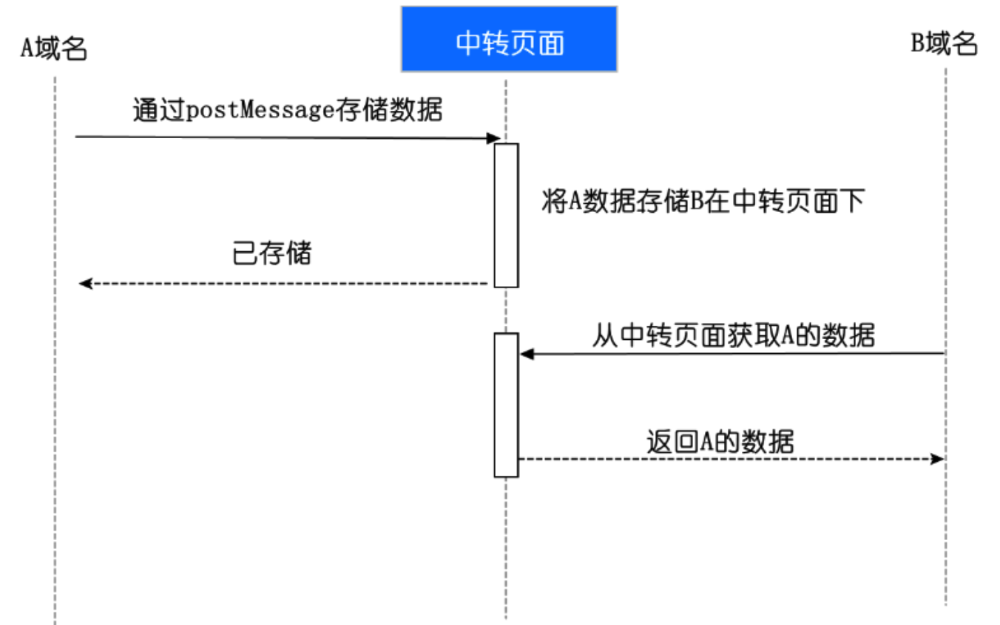
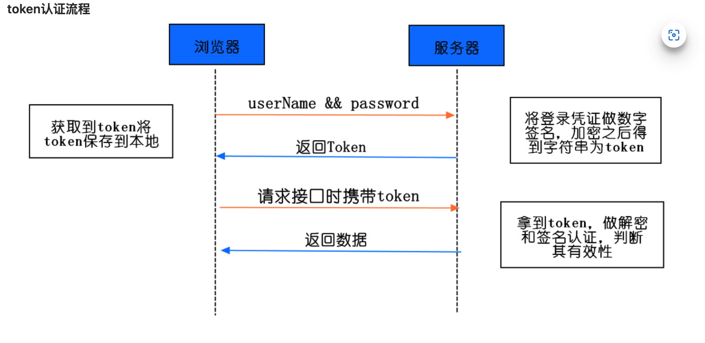
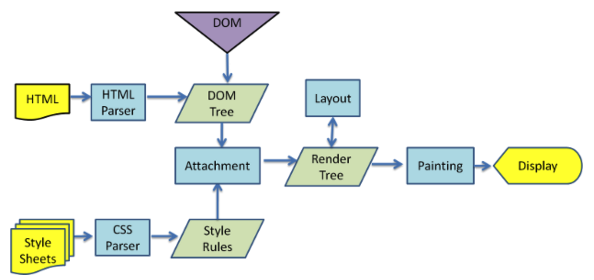

# 浏览器相关概念

### cookie sessionStorage localStorage

#### 共同点

都是保存在浏览器内的

#### 区别

1. cookie 始终会携带在 http 传输中；而另外两者仅在本地保存
2. 大小限制：cookie 不超过 4k，此外因为要不停来回传输，所以 cookie 不宜携带大量数据
3. 有效期：sessionStorage 仅在浏览器关闭前有效；localStorage 可以持久化；cookie 可以设置到期时间
4. 作用域：sessionStorage 在不同窗口中是隔离的（even 同一个page）；而另外两个都是在同源窗口之间共享的

### 实现一个会到期的 localStorage

懒删除，在存入的时候写入一个到期时间，读取的时候判断是否过期，如果过期就删除。

### localStorage 跨域

localStorage 不跨域，可以通过 window.postMessage 来实现跨域

```js
otherWindow.postMessage(message, targetOrigin, [transfer]);
```

* 通过一个公用的 iframe 作为桥梁
* A 通过 postMessage 将数据发到共享页面
* B 在从共享页面中读取数据



### localStorage 的限制

1. 只能存 string，需要手动转换
2. 隐私模式下不可读取
3. 低版本兼容性不好
4. 不能被爬虫到
5. 存储内容过多会导致页面卡

#### Cookie

#### 应用

1. 保存登录信息
2. 不同页面中共享数据

#### 获取 cookie

```js
document.cookie		// 'key1=value1; key2=value2....'
```

### token 能放在 cookie 里吗？

**Q: 能**

> token: 为了避免频繁向服务器发送用户名&密码进行登录查询



### 浏览器输入 URL 发生的事情

1. URL 解析
2. DNS 查询
3. TCP 连接
4. 处理请求
5. 接受响应
6. 渲染页面

### 浏览器渲染页面过程

1. HTML 被 HTML 解析器解析成 DOM 树
2. CSS 被 CSS 解析器解析成 CSSOM 树
3. 根据 DOM 树和 CSSOM 树生成一颗\*\*渲染树\*\*
4. 生成布局（flow）
5. 将布局绘制在屏幕上（paint）



### 避免 Reflow, Repaint

Repaint 不一定 Reflow，Reflow 一定会 Repaint，即：Repaint 低价小

Reflow：渲染树部分收到改变

Repaint：元素的外观改变，如颜色

#### 引发 Reflow 的操作

1. 添加，删除 DOM
2. 元素位置、大小改变
3. 页面渲染初始化
4. 浏览器窗口改变
5. 获取某些属性（offsetTop，offsetLeft...)

#### 优化

1. 浏览器本身会维护一个队列，将多次 reflow 操作放进队列，并到达一定数量/时间后再一次性 reflow
2. 不要一条一条的修改 DOM，多个节点统一修改 class
3. 使用 fixed，absolute，修改他们的样式时不会触发 reflow

### let 声明的全局变量存储在哪

不存储在 window 对象内，而是存储在块级作用域中

### 垃圾回收

通常两种方式：标记清除，引用计数

#### 标记清除

变量进入上下文时标记“进入”标记，离开上下文时加上”离开“标记。

#### 引用计数

跟踪每个对象被引用的次数，当有一个值引用了对象，他的 RC++，如果某个指针指向了其他对象，RC--，如果引用计数为 0 则会被释放掉。

#### GC 优化策略

1. 分代回收：区分”临时“与”持久“对象，多回收临时对象。
2. 增量回收：每次处理少一点，多次GC
