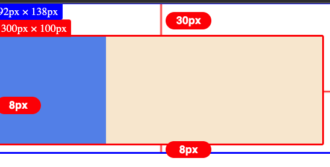

# 盒模型

### 盒模型

#### 块级元素

* 盒子在内敛方向上扩展，并占据父元素内所有可用空间，绝大多数情况下和父元素等宽。
* 每个盒子独占一行
* 可以设置 width, height，padding，margin，border

#### 内联元素

* 所有 inline 元素排成一行
* 不能设置高度、宽度
* 水平方向的 margin, border, padding 会把其他 `inline` 元素推开
* 垂直方向的 margin, border, padding 虽然会应用但是不会把其他 `inline` 元素推开

#### inline-block

是 block 和 inline 的折中，可以设置 width / height, 还能设置 padding, margin, border，但是不会换行。

#### 外部 & 内部显示类型

* 外部显示类型：决定盒子是\*\*块级\*\*元素还是**内联**元素
* 内部显示类型：决定黑子内部是如何布局的，默认情况时按照正常文档流，但也可以使用 flex / grid 布局。

### box-sizing

* content-box（默认），只包含 content
*   border-box，包含 content, padding, border

    > IE6 及更早版本默认使用的就是 border-box

### 外边距折叠

* 垂直方向的两个外边距相遇时，会合并成两者之间外边距大的那一个。
* 元素嵌套时，子元素的上下外边距也会和父元素的合并ÎÎ（如下所示）
* 即便是一个元素的上下外边距也会发生合并（内容高度为 0 时）
* 多个元素的上下外边距也会不断合并

> 外边距折叠只会发生块级元素的垂直方向上

```html
<head>
    <style>
        #container {
            width: 300px;
            height: 100px;
            background-color: antiquewhite;
            margin-top: 30px;
        }
        .child {
            width: 100px;
            height: 100%;
            background-color: cornflowerblue;
            /* 子元素的 margin-top 会和父元素的 magin-top 合并为 30px */
            margin-top: 20px;
        }
    </style>
</head>
<body>
    <div id="container">
        <div class="child"></div>
    </div>
</body>
```



### 包含块 Containing block

#### 作用

包含块通常为该元素的最近的\*\*块级祖先的内容区\*\*，但不总是这样。元素的大小、位置通常是根据它的包含块计算而得。

如一个元素的 width, height, padding, margin 等属性设置为某一百分比时，其参照的目标就是该元素的包含块的 width 或 height；或者某一元素的相对偏移位置，也是基于其包含块计算得来。

#### 如何确定元素的包含块？

确定元素的包含块完全取决于他的 `position` 属性：

1. `static`, `relative`, `sticky`：最近的\*\*块级祖先的内容区\*\*
2. `absolute`：最近非 `static` 的\*\*祖先元素的内边距区域\*\*
3. `fixed`：即浏览器的 viewport

> 注意 `absolute` 的包含块不仅仅是 content 区域，而是还额外包含了 padding 区域，参考下面的例子：

```html
<head>
    <style>
        #container {
            position: relative;
            height: 300px;
            width: 300px;
            padding: 50px;
            border: 4px solid blue;
            background-color: antiquewhite;
        }
        #child {
            position: relative;
            height: 100px;
            background-color: aqua;
            /* 包含块是父元素的 content 区域，即宽度为 300px / 2 */
            width: 50%;
        }
    </style>
</head>
<body>
    <div id="container">
        <div id="child"></div>
    </div>
</body>
```

但是如果将子元素修改为 `absolute` ，他的包含块就会变为最近祖先元素的内边距区域（包含了 padding）

```css
#child {
    position: relative;
    position: absolute;
    height: 100px;
    background-color: aqua;
    /* 包含块是父元素的内边距区域，即宽度为 (300 + 50 + 50) px / 2 */
    width: 50%;
}
```


#### 百分值的参考目标

1. height, top, bottom 根据包含块的 `height` 值
2. width, left, right, padding, margin 根据包含块的 `width` 值

### 块格式化上下文 BFC

1. 一个 BFC 区域只包含其子元素，不包含子元素的子元素
2. 不同 BFC 元素直接完全隔离，用这个特性使得 BFC 区域之间的布局不产生影响

#### 触发 BFC 的条件

* html 根元素
* float 元素
* poistion: absolute / fixed
* display: inline-block / flex / grid / 表格单元格 / 表格标题 / 匿名表格单元格元素
* overflow：不是 visiable(默认) 的元素

#### 使用场景

1.  避免被浮动的元素被覆盖

    ```html
    <head>
        <style>
            #float {
                float: left;
                height: 100px;
                width: 100px;
                background-color: antiquewhite;
            }
            #box {
                overflow: hidden;
                height: 300px;
                width: 300px;
                background-color: aqua;
            }
        </style>
    </head>

    <body>
        <div id="float"></div>
        <div id="box"></div>
    </body>
    ```


1. 防止 margin 塌陷
2. 只含有 float 元素的父元素高度为 0 ，为父元素设置 BFC 可以解决
3.  阻止文字环绕 float 元素

    ```css
    #container p {
        overflow: auto;
    }
    ```


### 背景

#### 背景颜色

`background-color` 支持：

* \#FFFFFF / #FFF
* \#FFFFFF; opacity: 0.5;
* rgb(255, 255, 255)
* rgba(255, 255, 255, 0.5)
* hsl(74, 64%, 59%), hsla(...)

#### 背景图片


**To be Continued**

