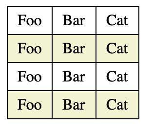

# CSS 相关概念

### 获取盒模型对应的宽高

* window.getComputedStyle(dom).width/height
* dom.offsetWidth, dom.offsetHeight 包括 content, padding, border

### 盒子塌陷

**子元素跑到父元素外部**：子元素设置了 float 属性，子元素会跳出父元素边界

解决方法：

1. 给所有 box size 写死
2. overflow（hidden, scroll)
3.  在父元素最底下加入

    ```html
    <br style="clear: both;"/>
    ```
4.  使用 :after 伪元素

    ```css
    #container:after {
      clear: both;
      content: "";
      width: 0;
      height: 0
      display: block;
      visibility: hidden;
    }
    ```
5. BFC，让父元素称为 BFC

### 样式优先级

#### 三种中样式类型

1.  行间

    ```html
    <h1 style="..."></h1>
    ```
2.  内联

    ```html
    <style>
      ...
    </style>
    ```
3.  外部

    ```html
    <link href='...' rel='stylesheet'>
    ```

#### 选择器类型

1. ID - #id
2. class - .class
3. 标签 - p, div, h1...
4. 通用 - \*
5. 属性 - \[type='text']
6. 伪类 - :hover
7. 伪元素 - ::first-line
8. 子选择器、相邻选择器 - > +

#### 优先级

1. 内联，style=""
2. ID选择
3. 类，伪类
4. 伪元素
5. 子选择器，相邻选择器

比较法则：

* 相同权值时，后出现的覆盖先出现的
* 指定的比继承的大
* 标有 !important 优先级最大

### 伪类 vs 伪元素

伪类：选择 DOM 树之外的信息，不能被普通选择器选择的；如 hover，active，visited...。元素可能在某一时刻变为某一个状态，然后得到一个伪类样式，之后还会失去这个样式。

伪元素：DOM 树没有定义的虚拟元素，创建不存于与文档中的元素。

### 行内元素的 margin padding

水平上有效果，垂直上无效


### min-width max-width (height)

1. max-width 覆盖 width
2. min-width 覆盖 max-width

### 居中的方式

#### 绝对定位 + transform

```js
<head>
    <style>
        #container {
            height: 500px;
            border: 3px solid blue;
            position: relative;
        }

        #box {
            width: 100px;
            height: 100px;
            background-color: aqua;
            position: absolute;
            top: 50%;
            left: 50%;
            transform: translate(-50%, -50%)
        }
    </style>
</head>
<body>
    <div id="container">
        <div id="box"></div>
    </div>
</body>
```


#### flex

```js
#container {
  height: 500px;
  border: 3px solid blue;
  display: flex;
  align-items: center;
  justify-content: center;
}
#box {
  width: 100px;
  height: 100px;
  background-color: aqua;
}
```

### 表格斑马纹

```html
<head>
    <style>
        table {
            border-collapse: collapse;
        }

        td {
            border: 1px solid #000;
            padding: 5px 10px;
        }

        tr:nth-child(even)  {
            background-color: beige;
        }
    </style>
</head>
<body>
    <table>
        <tr>
            <td>Foo</td>
            <td>Bar</td>
            <td>Cat</td>
        </tr>
        <tr>
            <td>Foo</td>
            <td>Bar</td>
            <td>Cat</td>
        </tr>
        <tr>
            <td>Foo</td>
            <td>Bar</td>
            <td>Cat</td>
        </tr>
        <tr>
            <td>Foo</td>
            <td>Bar</td>
            <td>Cat</td>
        </tr>
    </table>
</body>
```



### 文本居中

#### 水平居中

**text-align**，可以被继承

```js
<head>
    <style>
        p {
            border: 2px solid blue;
            text-align: center;
        }
    </style>
</head>

<body>
    <p>
        Hello world
    </p>
</body>
```


### 垂直居中

单行文本，设置 line-height 和容器 height 一致

```html
<head>
    <style>
        p {
            border: 2px solid blue;
            text-align: center;
            height: 100px;
            line-height: 100px;
        }
    </style>
</head>
<body>
    <p>
        Hello world
    </p>
</body>
```


多行文本，让文本自动撑开，然后设置 padding

```html
<head>
    <style>
        p {
            border: 2px solid blue;
            padding: 20px 0;
        }
    </style>
</head>
<body>
    <p>
        Hello world! Hello world! Hello world! Hello world! Hello world! Hello world! Hello world! Hello world! Hello world! Hello world! Hello world! Hello world! 
    </p>
</body>
```


### flex 实现九宫格

利用：padding-top, width 的百分比来创建正方形，父容器设置为 wrap

```html
<head>
    <style>
        #container {
            border: 3px solid blue;
            display: flex;
            flex-wrap: wrap;
            justify-content: space-around;
            padding-bottom: 3%;
        }
        .cell {
            padding-top: 30%;
            margin-top: 3%;
            width: 30%;
            background-color: aquamarine;
        }
    </style>
</head>
<body>
   <div id="container">
    <div class="cell"></div>
    <div class="cell"></div>
    <div class="cell"></div>
    <div class="cell"></div>
    <div class="cell"></div>
    <div class="cell"></div>
    <div class="cell"></div>
    <div class="cell"></div>
    <div class="cell"></div>
   </div>
</body>
```


### transform

translate：位移

scale：缩放

rotate: 旋转

skew：翻转

### css 实现等腰三角形

```html
<head>
    <style>
        .triangle {
            width: 0;
            height: 0;
            border-left: 80px solid;
            border-right: 80px solid;
            border-bottom: 100px solid cyan;
        }
    </style>
</head>
<body>
   <div class="triangle"></div>
</body>
```


**实际上，把左右两边的 border 设置成透明就是一个等腰三角形了**

### css 实现等边三角形

border-bottom 即三角形的高度即 sqrt(3) \* (底边 / 2)

```html
<head>
    <style>
        .triangle {
            width: 0;
            height: 0;
            border-left: 50px solid transparent;
            border-right: 50px solid transparent;
            border-bottom: 86.60px solid cyan;
        }
    </style>
</head>
<body>
   <div class="triangle"></div>
</body>
```


### css 实现扇形

```html
<head>
    <style>
        .circle {
            height: 30px;
            width: 30px;
            border-radius: 100% 0 0 0;
            background-color: aqua;
        }
    </style>
</head>
<body>
   <div class="circle"></div>
</body>
```


### css 旋转

```html
<head>
    <style>
        .circle {
            margin: 50px;
            height: 100px;
            width: 100px;
            background-color: aqua;
            transform: rotate(45deg);
        }
    </style>
</head>
<body>
   <div class="circle"></div>
</body>
```


### 0.5px 直线

```html
<head>
    <style>
        .line {
            height: 1px;
            transform: scaleY(0.5);
            background-color: aqua;;
        }
    </style>
</head>
<body>
   <div class="line"></div>
</body>
```

#### 平均分布

利用 flex 自动伸缩

```html
<head>
    <style>
        #container {
            border: 3px solid blue;
            display: flex;
        }
        .item {
            background-color: aqua;
            flex: 1 0 auto;
            margin: 0 10px;
        }
    </style>
</head>
<body>
    <div id="container">
        <div class="item">Item</div>
        <div class="item">Item</div>
        <div class="item">Item</div>
    </div>
</body>
```


### rem

设计稿标准都是 750 / 375

1rem = 16px

为了简化计算，修改默认 font-size 为 10px

```css
html {font-size: 62.5%;  } /*  公式16px*62.5%=10px  */ 
```

这样页面中1rem=10px,1.2rem=12px,1.4rem=14px,1.6rem=16px;使得视觉、使用、书写都得到了极大的帮助；
