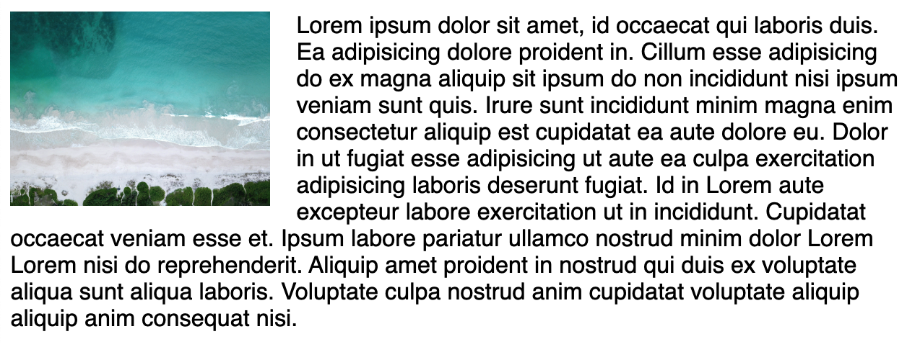

# Layout 布局

### position 属性

#### static

static 是默认样式。

#### relative

元素不会被移除文档流，仍然会占据原始空间。发生偏移时，是相对原始位置的偏移。


#### absolute

元素被拿出文档流，其余元素重新定位。发生偏移时，是根据其包含块（即最近的非 static 祖先元素，若不存在，即根据 html 元素）进行偏移。


#### fixed

与 absolute 类似，偏移根据浏览器窗口本身。

#### sticky

是 relative 和 fixed 的结合。当元素滚动到特定偏移位置时（相对浏览器窗口，就保持不动）。


### 浮动 float

盒子向左 / 右移动，直到其外边沿接触包含块的边缘，或接触到另一个浮动元素的边缘。

浮动的元素也会脱离正常文档流，其他元素\*\*几乎\*\*当它不存在。


之所以说其他元素会几乎当浮动元素不存在是因为，文字并不会忽略 float 的元素。



#### clear 属性

控制元素是否移动到他之前浮动元素的下方。


当元素应用了 clear 属性后，实际上浏览器给这个元素应用了一个 margin-top 来让他被推倒 float 元素的下方。因此，你想要自行添加一个额外的 margin-top，这个 margin-top 的值是相对于前一个元素，而不是被 float 的元素。

```css
#container p:nth-of-type(2) {
    clear: left;
    margin-top: 100px;
}
```


此外，如果一个元素里只有一个 float 元素，父元素的高度会是 0 ，因此可以通过 ::after 伪元素，在父元素末尾添加一个空内容，并且设置 clear 为 both。

```css
#container::after {
    content: "";
    display: block;
    clear: both;
}
```
