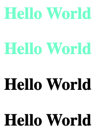
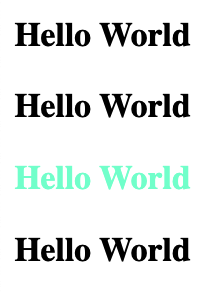
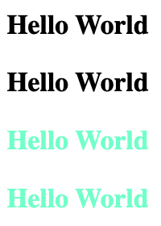
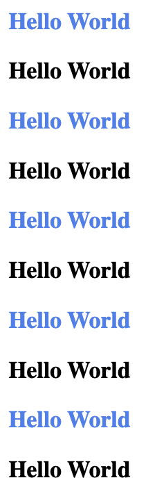
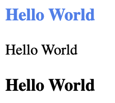
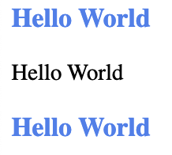

# Styles 样式

### 选择器

#### 后代选择

用空格隔开，选择某个或某组元素的后代

```css
div h3 {
    ...
}
```

#### 子选择 `>`

只选择某个元素的直接后代（第一层）

```css
div > h3 {
    ...
}
```

> ⚠️ 子选择 `>` 不是只选择“一个”后代，而是只选择“一层”后代

```html
<head>
    <style>
        #container > h3 {
            color: aquamarine;
        }
    </style>
</head>
<body>
    <div id="container">
        <h3>Hello World</h3>
        <h3>Hello World</h3>
        <div>
            <!-- 非第一层后代不能被选择到 -->
            <h3>Hello World</h3>
            <h3>Hello World</h3>
        </div>
    </div>
</body>
```



#### 同辈选择 `+`

选择与某元素“同级”的后面“一个”元素

```html
<head>
    <style>
        #container  h3 {
            color: aquamarine;
        }
    </style>
</head>
<body>
    <h3>Hello World</h3>
    <div id="container">
        <h3>Hello World</h3>
    </div>
    <!-- 只能选择同级后面的“一个元素” -->
    <h3>Hello World</h3>
    <h3>Hello World</h3>
</body>
```



#### 一般同辈 `~`

与同辈选择 `+` 类似，但是可以选择某元素同级后面的“所有”元素

```html
<head>
    <style>
        #container ~ h3 {
            color: aquamarine;
        }
    </style>
</head>
<body>
    <h3>Hello World</h3>
    <div id="container">
        <h3>Hello World</h3>
    </div>
    <!-- 同级后面的”所有“元素都可以选择 -->
    <h3>Hello World</h3>
    <h3>Hello World</h3>
</body>
```



#### 属性选择

选择包含某一属性（或某属性为特定值）的元素。如：

```css
input[type='submit'] {
    ...
}
```

还可以使用通配符

```css
/* 匹配以某些字符开头的 */
a[href^='http'] { }

/* 匹配以某些字符结尾的 */
a[href$='.html'] { }

/* 匹配包含某些字符的 */
a[href*='google'] { }
```

### 伪元素

伪元素不是在已有的元素上应用类，而是加入新的元素。

> 为了和伪类区分，伪元素使用 `::`

| 选择器                                                                                     | 描述                         |
| --------------------------------------------------------------------------------------- | -------------------------- |
| [`::after`](https://developer.mozilla.org/zh-CN/docs/Web/CSS/::after)                   | 匹配出现在原有元素的实际内容之后的一个可样式化元素。 |
| [`::before`](https://developer.mozilla.org/zh-CN/docs/Web/CSS/::before)                 | 匹配出现在原有元素的实际内容之前的一个可样式化元素。 |
| [`::first-letter`](https://developer.mozilla.org/zh-CN/docs/Web/CSS/::first-letter)     | 匹配元素的第一个字母。                |
| [`::first-line`](https://developer.mozilla.org/zh-CN/docs/Web/CSS/::first-line)         | 匹配包含此伪元素的元素的第一行。           |
| [`::grammar-error`](https://developer.mozilla.org/zh-CN/docs/Web/CSS/::grammar-error)   | 匹配文档中包含了浏览器标记的语法错误的那部分。    |
| [`::selection`](https://developer.mozilla.org/zh-CN/docs/Web/CSS/::selection)           | 匹配文档中被选择的那部分。              |
| [`::spelling-error`](https://developer.mozilla.org/zh-CN/docs/Web/CSS/::spelling-error) | 匹配文档中包含了浏览器标记的拼写错误的那部分。    |

#### after before

配合 `content` 属性一起使用，可以通过 css 将内容插入到文档中

```html
<head>
    <style>
        #container::before {
            content: "Hello World";
        }
    </style>
</head>
<body>
    <div id="container"></div>
</body>
```

> 多数浏览器的阅读模式会忽略伪元素插入的内容

### 伪类

> 可以同时选择选择多个伪类

#### 常用伪类

* :link，没有访问过的超链接
* :visited，访问过的超链接
* :hover，鼠标悬浮
* :focus，键盘获取焦点
* :activate，被用户激活（使用鼠标时的按下和松开时间之间）

#### target

选择一个 ID 与 URL 片段（#后面的字符）匹配的元素，如下面会匹配 id 为 ”id“ 的元素

```
https://localhost/#id
```

```html
<head>
    <style>
        #btn {
            width: 100px;
            height: 40px;
            border: 3px solid black;
        }

        div:target {
            background-color: aqua;
        }
    </style>
</head>
<body>
    <div id="btn"></div>
</body>
```


#### :nth-child()

语法：`nth-child(an+b)`，找到当前元素的”所有“兄弟元素，并从 1 开始排序（注意不是0），选择的结果括号中表达式匹配到的元素集合（n = 0, 1, 2...)。如：

* 0n + 3：匹配第 3 个元素
* 2n + 0：匹配第 0, 2, 4... 个元素
* 2n + 1：匹配第 1, 3, 5... 个元素

```css
#container h3:nth-child(2n + 1) {
    color: cornflowerblue;
}
```



* \-n + 3：只匹配前三个
* odd, even

> 反正只需要将 n = 0, 1, 2... 代入，就可以计算出结果

#### :nth-last-child()

与 nth-child 类似，只不过是倒序的选择

> 注意 an + b 是唯一合法的格式，不能使用 b + an 的顺序

#### :first-child, last-child

相当于 nth-child(1), nth-last-child(1)

#### :nth-type-of()

找到某一元素的“同类型”兄弟元素。与 `nth-child` 不同的是，`nth-child` 会在“所有”兄弟里面寻找，如果寻找到的元素和类型不匹配，就会忽略。如下面的例子（ -n + 2 表示选择前两项）：

```html
<head>
    <style>
        #container h3:nth-child(-n + 2) {
            color: cornflowerblue;
        }
    </style>
</head>
<body>
    <div id="container">
        <h3>Hello World</h3>
        <!-- 第二个元素不会被选择，而会被自动忽略 -->
        <p>Hello World</p>
        <h3>Hello World</h3>
    </div>
</body>
```



```html
<head>
    <style>
        #container h3:nth-of-type(-n + 2) {
            color: cornflowerblue;
        }
    </style>
</head>
<body>
    <div id="container">
        <h3>Hello World</h3>
        <p>Hello World</p>
        <!-- 只会在所用 h3 里面排序选择 -->
        <h3>Hello World</h3>
    </div>
</body>
```



#### 表单伪类

* :required，选择带有 required 属性的  标签（标识内容必填）
* :optional，与 :required 对应，表示没有 required 属性的  标签
* :valid，输入内容有效（如邮件）
* :invalid，与 :valid 对应


### 叠层 Cascade

样式优先级为：

* 标注了 !important 的用户样式
* 标注了 !important 的作者样式
* 作者样式
* 用户样式
* 浏览器默认样式

### 优先级 Specificity

用 a, b, c, d 4 个数字从左只有拼成的十进制数来表示一个样式选择的优先级

* 行内样式，a = 1
* b = ID 选择数量
* c = 类、伪类、属性选择的数量
* d = 类型、伪元素选择符的数量

> 如果类型优先级相同，则后面的会覆盖前面的规则

#### 控制优先级顺序

诸如 :hover :visited 等的伪类实际上是拥有相同的优先级的，这样就会产生冲突。

如一个连接被点击后，如果 :visited 写在 :hover 后面，那么这个元素的 :hover 样式不会被激活，因为它永远都会被 :visited 覆盖。

因此遵循一个 `Lord Vader Hates Furry Animals` 法则，即顺序应该为：:link, :visited, :hover, :focus, activate。

### 样式继承

#### 不能继承的样式

1. display
2. 文本属性
3. 盒子模型
4. 背景属性
5. 定位属性

#### 可以继承的属性

1. 字体（大小，字体样式，字重）
2. 元素可见性
3. 表格布局

#### 继承没有优先级

继承没有优先级，也可以理解成继承的优先级 < 0。`*` 选择器的优先级为 0，然而它依然可以覆盖掉被继承的样式。

#### 控制继承

通过四种属性来设置某一样式是否继承父元素：

* inherit，继承父元素
* initial，设置为默认样式，如果没有默认样式，则会开启 inherit
* unset，如果属性本身支持继承那就是 inherit，不然就是 initial
* revert，和 unset 相反

还可以通过 `all` 属性来重设所有属性的继承关系

```css
#child {
    /* 所有属性都不继承 */
    all: initial;
}
```

### link 与 style

通常有两种方法引入 css 样式：

* `<link rel='stylesheet' href='/style.css' />`
* 通过 `<style>` 标签
  * 直接写在标签内部
  *   在标签内部使用 `@import`

      ```html
      <style>
          @import url(/style.css)
      </style>
      ```

通常，更推荐使用 `link` 的方法，而不是使用 `@import`。
