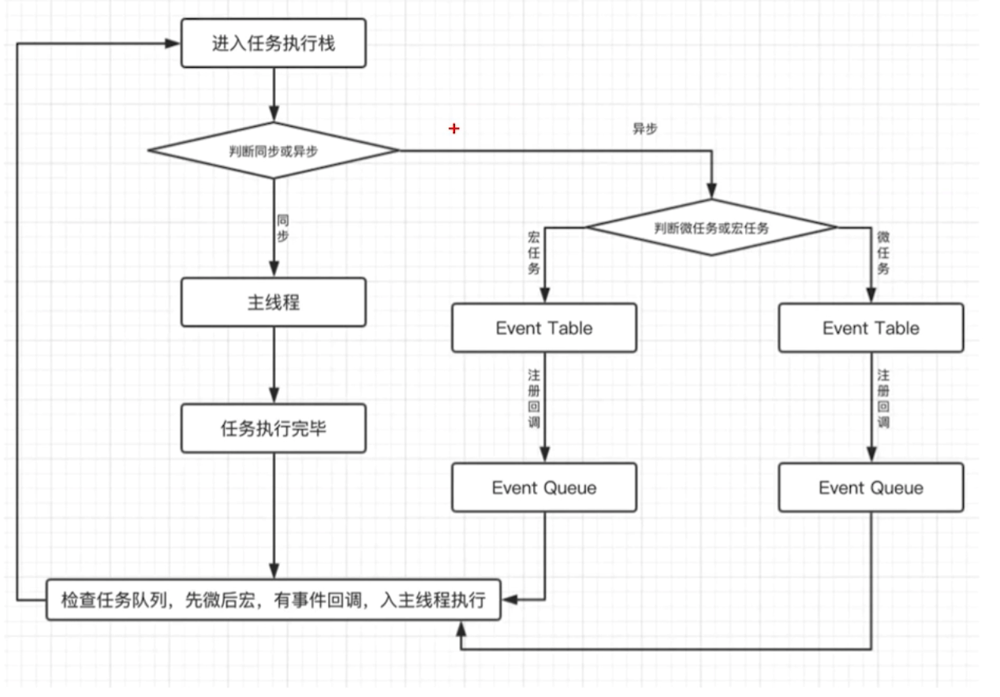

# Event Loop 事件循环

代码分同步代码和异步代码，而异步代码分为：

* 宏任务：`script`, `setTimeout`, `setInterval`，由宿主环境发起的任务
* 微任务：`Promise`, `await`，由 JS 引擎本身发起的任务

另外，还需要知道：

* `setTimeout` 属于宏任务
* `Promise` 本身是同步的立即执行函数，`Promise.then` 属于微任务
* `async` 方法执行时，遇到 `await` 会立即执行表达式，表达式之后的代码放到微任务执行
* 微任务优先级大于宏任务

## 顺序

* 先同后异
* 先微后宏

Event Loop:



```javascript
setTimeout(() => { 
    console.log('timeout callback1（）')
    Promise.resolve(3).then(
      value => { 
        console.log('Promise onResolved3()', value)
      }
    )
  }, 0)
 
  setTimeout(() => { 
    console.log('timeout callback2（）')
  }, 0)
 
  Promise.resolve(1).then(
    value => { 
      console.log('Promise onResolved1()', value)
      setTimeout(() => {
        console.log('timeout callback3（）', value)
      }, 0)
    }
  )
 
  Promise.resolve(2).then(
    value => { 
      console.log('Promise onResolved2()', value)
    }
  )
 
  // Promise onResolved1() 1
  // Promise onResolved2() 2
  // timeout callback1（）
  // Promise onResolved3() 3
  // timeout callback2（）
  // timeout callback3（） 1
```
