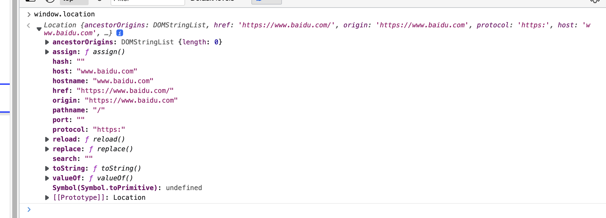

# 手写实现

### Math.min() vs Math.max()

```js
var min = Math.min();		// 没有参数是默认 Infinity
max = Math.max();				// 没有参数是默认 -Infinity
console.log(min < max);	// false
```

### Object.create()

```js
var company = {
    address: 'beijing'
}
var yideng = Object.create(company);
delete yideng.address
console.log(yideng.address);	// beijing，实际上还是指向的是 company
```

这里的 yideng 通过 prototype 继承了 company的 address。yideng自己并没有address属性。所以delete操作符的作用是无效的。

### 使用 setInterval 请求数据，顺序不一致

服务器不稳定时，后一个结果可能比前一个先到达

```js
setInterval(function() {
    $.get("/path/to/server", function(data, status) {
        console.log(data);
    });
}, 100)
```

改用 setTimeOut

```js
function get() {
  fetch('...').then( v => setTimeout(get, 100))
}
```

### 防抖

事件触发 n 秒后再执行回调，如果在 n 秒内又被触发，则重新计时

常见场景：

* 搜索框输入
* 手机号、邮箱验证的检测
* 窗口 Resize，只有大小调整好后，再重新计算渲染

```js
function debounce(fn, delay) {
    var timer; // 维护一个 timer
    return function () {
        var _this = this; // 取debounce执行作用域的this
        var args = arguments;
        if (timer) {
            clearTimeout(timer);
        }
        timer = setTimeout(function () {
            fn.apply(_this, args); // 用apply指向调用debounce的对象，相当于_this.fn(args);
        }, delay);
    };
}
```

### 节流

防抖可能会产生“饥饿“问题，节流类似于给函数赋予一个 CD，一次函数执行后的一定时间内不能再被触发

常见场景

* 高频次提交，表单重复提交
* 滚动加载

```js
function throttle(fn, delay) {
  let locked = false
  return function() {
    const _this = this, args = arguments
    if (!locked) {
      locked = true
      setTimeout(() => {
        fn.call(_this, ...args)
        locked = false
      }, delay)
    }
  }
}
```

### 浅拷贝 & 深拷贝

#### 浅拷贝

浅拷贝只复制第一层，使用 Object.assign() 可以实现

#### 深拷贝

1. JSON.stringify(), JSON.parse()
2.  递归实现

    ```js
    function deepClone(obj){
        let objClone = Array.isArray(obj)?[]:{};
        if(obj && typeof obj==="object"){
            for(const key in obj){
                if(obj.hasOwnProperty(key)){
                    //判断ojb子元素是否为对象，如果是，递归复制
                    if(obj[key]&&typeof obj[key] ==="object"){
                        objClone[key] = deepClone(obj[key]);
                    }else{
                        //如果不是，简单复制
                        objClone[key] = obj[key];
                    }
                }
            }
        }
        return objClone;
    }
    ```

### 获取页面 URL

```js
window.location.href
```



### 交集 并集 差集

```js
// 交集
function intersect(arr1, arr2) {
    const a = new Set(arr1), b = new Set(arr2)
    return [...a].filter(e => b.has(e))
}

// 并集
function union(arr1, arr2) {
    return [... new Set([...arr1, ...arr2])]
}

// 差集
function minus(arr1, arr2) {
    const a = new Set(arr1), b = new Set(arr2)
    return [...a].filter(e => !b.has(e))
}
```

### 千分位数字

```js
// toLocaleString()
const n = 1532512.5111
console.log(n.toLocaleString())

// regx
```

### 判断对象是否为空

```js
function isEmpty(obj) {
    return obj === null || obj === undefined || (typeof obj === 'object' && Object.keys(obj).length === 0 )
}
```

### 传入 \[1,\[\[2],3,4],5] ，返回 \[1,2,3,4,5]

```js
function flatten(arr) {
    return arr.reduce((pre, cur) => pre.concat(Array.isArray(cur) ? flatten(cur) : cur), [])
}
console.log(flatten([1, [[2], 3, 4], 5]))

// solution 2
function flatten(arr) {
    var result = [];
    for (var i = 0, len = arr.length; i < len; i++) {
        if (Array.isArray(arr[i])) {
            result = result.concat(flatten(arr[i]))
        }
        else {
            result.push(arr[i])
        }
    }
    return result;
}

// solution 3
function flatten(arr) {

    while (arr.some(item => Array.isArray(item))) {
        arr = [].concat(...arr);
    }

    return arr;
}
```

### 16 进制转 rgb

```js
function toRGB(color) {
    const res = []
    color = color.replace('#', '')
    for (let i = 0; i < color.length; i += 2)
        res.push(parseInt(color.substring(i, i + 2), 16))
    return `(${res.join(',')})`
}
```

### 实现 sleep

```js
function sleep(time) {
    return new Promise(resolve => {
        setTimeout(resolve, time)
    })
}

console.log('start')
sleep(1000).then(() => console.log('end'))
```

### 生成 N 个范围在 (min, max) 中的数

```js
function rand(min, max, N) {
    const res = new Set()
    while (res.size < N)
        res.add(Math.random() * (max - min + 1) + min)
    return [...res]
}
console.log(rand(10, 20, 5))	// [11.017595557525082, 15.637361330399937, 11.837208769291326, 20.813048069221455, 10.988156387379528]
```

### 拆分查询参数

```js
function getParams() {
  const res = {}
  const str = window.location.search.substring(1)
  if (str.length < 1)
    return res
  const params = str.split('&')
  for (const param of params) {
    const i = param.indexOf('=')
    res[param.substring(0, i)] = param.substring(i + 1)
  }
  return res
}
```

### 去掉字符串前后的空格

```js
function trim(str) {
    let left = 0, right = str.length - 1
    // left side
    while (left < str.length && str[left] === ' ')
        left++
    if (left === str.length)
        return ''
    // right side
    while (right >= 0 && str[right] === ' ')
        right--
    return str.substring(left, right + 1)
}


console.log(trim('b '))
```

```js
// 正则
function trim(str) {
    return str.replace(/^\s*/, "").replace(/\s*$/, "")
}
```

### 三数之和，双指针

```js
var threeSum = function (nums) {
    if (nums.length < 2)
        return []
    const res = new Set()
    nums.sort((a, b) => a - b)
    for (let i = 0; i < nums.length - 2; i++) {
        let left = i + 1, right = nums.length - 1
        while (left < right) {
            const sum = nums[i] + nums[left] + nums[right]
            if (sum === 0) {
                // 注意不要直接添加数组，不然不能去重
                res.add([nums[i], nums[left], nums[right]].join(','))
                left++
                right--
            } else if (sum < 0) {
                left++
            } else {
                right--
            }
        }
    }
    return [...res].map(x => x.split(','))
};
```

### 环形链表

```js
var detectCycle = function(head) {
    if (!head)
        return null
    let slow = head, fast = head
    while (fast && fast.next) {
        slow = slow.next
        fast = fast.next.next
        if (slow === fast) {
            // 存在 loop，寻找入口
            let p1 = head, p2 = fast
            while(p1 !== p2) {
                p1 = p1.next
                p2 = p2.next
            }
            return p1
        }
    }
    return null
};
```

### 二叉树公共祖先

```js
var lowestCommonAncestor = function(root, p, q) {
    if (!root ||root === p || root === q)
        return root
    const l = lowestCommonAncestor(root.left, p, q)
    const r = lowestCommonAncestor(root.right,p, q)
    if (l && r)
        return root
    else if (l && !r)
        return l
    else if (!l && r)
        return r
    else
        return null
}
```

### 层序构建二叉树

```js
function TreeNode(val, left, right) {
    this.val = (val === undefined ? 0 : val)
    this.left = (left === undefined ? null : left)
    this.right = (right === undefined ? null : right)
}

function createTree(arr) {
    if (arr.length === 0)
        return null
    const root = new TreeNode(arr.shift(), null, null)
    const queue = [root]
    while (queue.length > 0) {
        const len = queue.length
        for (let i = 0; i < len; i++) {
            const t = queue.shift()
            const l = arr.shift(), r = arr.shift()
            t.left = l == null ? null : new TreeNode(l, null, null)
            t.right = r == null ? null : new TreeNode(r, null, null)
            t.left && queue.push(t.left)
            t.right && queue.push(t.right)
        }
    }
    return root
}
```

### 快排

```js
function quickSort(arr) {
    if (arr.length < 2)
        return arr
    const splitIdx = Math.floor(arr.length / 2)
    const pivot = arr.splice(splitIdx, 1)[0]
    const left = [], right = []
    for (let i = 0; i < arr.length; i++) {
        if (arr[i] < pivot)
            left.push(arr[i])
        else
            right.push(arr[i])
    }
    return [...quickSort(left), pivot, ...quickSort(right)]
}
```

### 归并排序

```js
function mergeSort(arr) {
    if (arr.length < 2)
        return arr
    const mid = Math.floor(arr.length / 2)
    const left = arr.slice(0, mid), right = arr.slice(mid)
    return merge(mergeSort(left), mergeSort(right))
}

function merge(left, right) {
    const res = []
    while (left.length > 0 && right.length > 0) {
        if(left[0] < right[0])
            res.push(left.shift())
        else
            res.push(right.shift())
    }
    while(left.length)
        res.push(left.shift())
    while(right.length)
        res.push(right.shift())
    return res
}
```

### ES5 继承

```js
function A() {
    this.className = 'A'
}
A.prototype.whoami = function() {
    console.log(this.className)
}

function B() {
    this.className = 'B'
}

B.prototype = new A()
B.prototype.constructor = A

const b = new B()
b.whoami()

// 或者
function B() {
  A.call(this)
}
```

### 异步加法

```js
// 模拟一个异步加法
async function asyncAdd(a, b) {
    await new Promise(resolve => setTimeout(resolve, Math.floor(Math.random() * 500)))
    return a + b
}

// 使用归并递归相加
async function solve(nums) {
    if (nums.length < 2)
        return nums[0]
    const mid = Math.floor(nums.length / 2)
    // 注意 solve 函数本身就是异步的，所以要在调用前加 await ！
    const l = await solve(nums.slice(0, mid)), r = await solve(nums.slice(mid, nums.length))
    return await asyncAdd(l, r)
}

solve([1, 2, 3, 4, 5]).then(v => console.log(v))
```

```js
function asyncAdd(a, b) {
    return new Promise(resolve => setTimeout(() => resolve(a + b), Math.random() * 1000))
}

async function solve(arr) {
    const sum = await arr.reduce(async (pre, cur) => await asyncAdd(await pre, cur), 0)
    console.log(sum)
}

solve([1,2,3])  // 6
```

```js
function asyncAdd(a, b) {
    return new Promise(resolve => setTimeout(() => resolve(a + b), Math.random() * 1000))
}

async function asyncSum(arr) {
    if (arr.length < 2) return arr[0]
    const promiseList = []
    let i = 0
    for (; i < arr.length - 1; i += 2)
        promiseList.push(asyncAdd(arr[i], arr[i + 1]))
    if (i < arr.length)
        promiseList.push(arr[arr.length - 1])
    return asyncSum(await Promise.all(promiseList))
}

asyncSum([1, 2, 3, 4, 5, 6, 7, 8, 9]).then(v => console.log(v)) // 45
```

### 手写 new

```js
function myNew(Func, ...args) {
       // 创建一个空的对象,将实例化对象的原型指向构造函数的原型对象
       const instance = Object.create(Func.prototype);
       // 将构造函数的this指向实例化对象
       const res = Func.apply(instance, args);
       //判断返回值
       return typeof res === "object" ? res : instance;
}
```

#### 手写实现 bind

```js
Function.prototype.bind = function (thisArg, ...args) {
    const obj = this	// 谁调用了 bind，this 就指向谁
    return function (...rest) {
        return obj.apply(thisArg, [...args, ...rest])
    }
}
```

###
