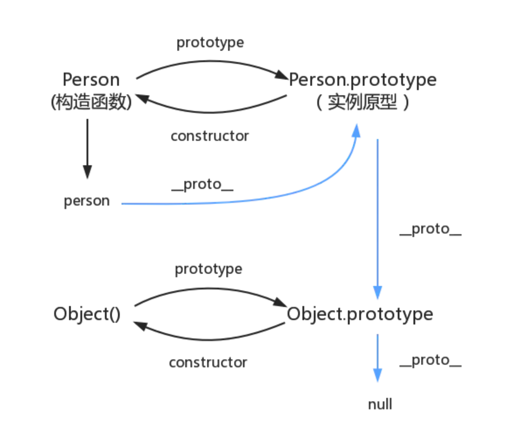

# Prototype 原型

### 概念

JS 通过原型链来实现继承，而在集成时，不会复制父类属性，还是在子类和父类之间创建一个关联。



### 原型链

当我们访问一个属性的时候，如果没有，就会顺着 `__proto__` 原型链一路向上找。如果找到 `Object.prototype` 还是没有找到，就返回 `undefined`

### prototype **proto**

* 函数都有 `prototype`
* 对象都有 `__proto__`
* 所用函数都由 Function 创建而来，所以它们的 **proto** 都是 `Function.prototype`
* Function.protype = Function.**proto**

### 解决原型链污染问题

我们可以覆盖掉对象原型上的属性，如下：

```js
Object.prototype.toString = function() {
    alert('Hello World')
}

const obj = {}
obj.toString() Object.prototype.toString = function() {    alert('Hello World')}const obj = {}obj.toString()
```

#### 解决方法

1.  Object.create(null)，将对象的原型设置为 null

    ```js
    const obj = Object.create(null)
    ```
2. Object.freeze(obj)，使对象的属性不可修改

### ES5 继承方式

#### 原型链继承

将子类的原型指向父类的实例

```js
function SuperType() {
    this.foo = 'bar'
}

function SubType() {}

// 继承
SubType.prototype = new SuperType()
```

#### 盗用构造函数

子类中使用 `call` 方法，将 this 绑定到父类上

```js
function SuperType() {
    this.foo = 'bar'
}

function SubType() {
    SuperType.call(this)
}

console.log(new SubType().foo)  // bar
```

#### 组合继承

原型链 + 盗用

```js
function SuperType() {
    this.foo = 'bar'
}

SuperType.prototype.output = function() {
    console.log(this.foo)
}

function SubType() {
    SuperType.call(this)            // 继承属性
}

SubType.prototype = new SuperType()   // 集成方法

const subType = new SubType()
console.log(subType.foo)            // 访问父级属性 bar
subType.output()                    // 访问父级方法 bar5
```

#### 寄生组合继承

```js
function SuperType() {
}
function SubType() {
    SuperType.call(this)    // 继承父类属性
}
SubType.prototype = Object.create(SuperType.prototype)	// 取得父类的一个副本
SubType.prototype.constructor = SubType
```
