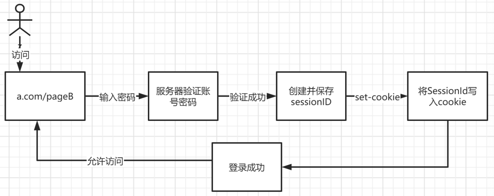
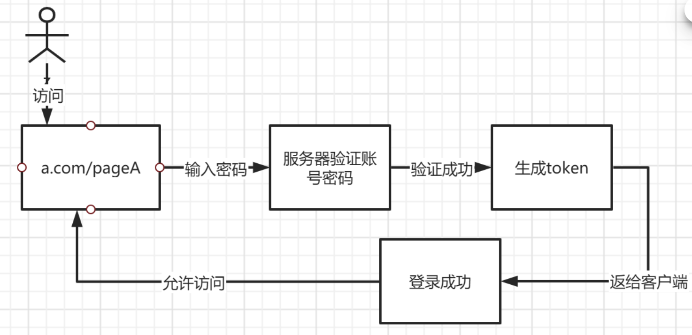

# 认证手段

### 登录方式

#### cookie + session

不足之处：

* 服务器需要存放大量的 sessionID
* 服务器集群之间需要同步
* 容易遭受攻击

#### token

和 session 的区别

* 不需要保存在服务器端，减轻服务器压力
* 由客户端自由决定存储方式

缺点：在过期前不易撤回权限

生成方式（JWT）：

包含3个部分

* header：指定使用的签名算法
* payload：token 内容
* signature：防止被篡改

#### SSO 单点登录

统一的公共认证中心，所有产品都在这里完成登录

#### OAtuh 第三方

### Session vs Token

session 相当于每次和服务器进行比对，但是服务器需要存储。

token 相当于动态计算，只需要客户端保存，服务器拿到计算一次就行。

#### Token 优势

* 无状态，可扩展
