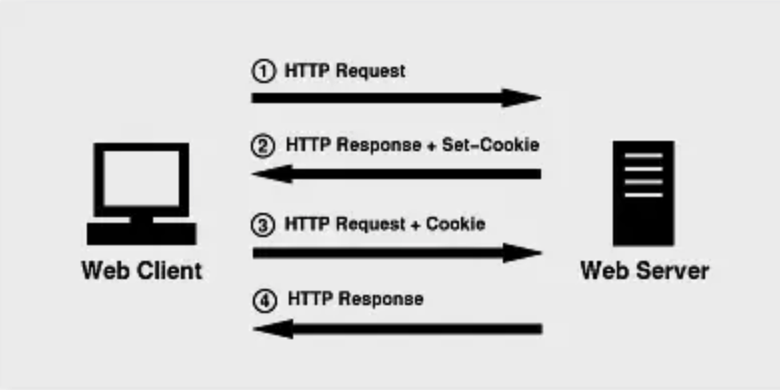
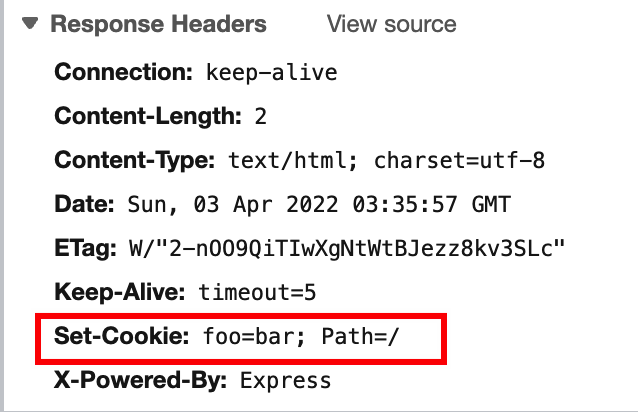
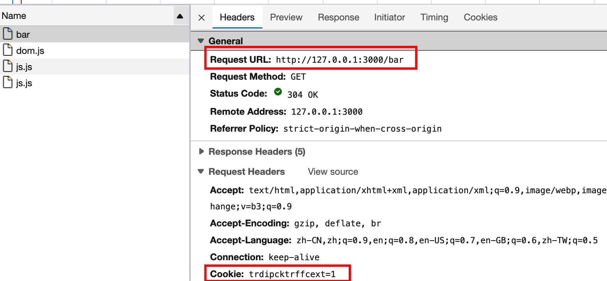
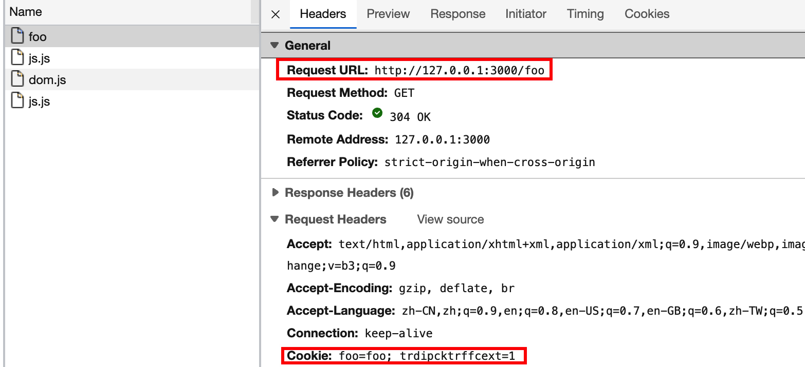

# Cookies

### 机制

1. 客户端向服务器发送请求
2. 服务器返回数据，并设置 Cookie
3. 之后客户端请求中都会带着 Cookie



> 🔹 随着现代浏览器开始支持各种各样的存储方式，Cookie 渐渐被淘汰。由于服务器指定 Cookie 后，浏览器的每次请求都会携带 Cookie 数据，会带来额外的性能开销（尤其是在移动环境下）。新的浏览器API已经允许开发者直接将数据存储到本地

### Cookie 属性

| 属性                 | 描述                                                  |
| ------------------ | --------------------------------------------------- |
| Name               | key                                                 |
| Value              | Value                                               |
| Domain             | 允许 Cookie 发送给的域名（默认情况下**不包含子域名**，但特别指定的话**反而可以包含**） |
| Path               | 允许 Cookie 发送的路径 （**子路径也会匹配**）                       |
| Exprires / Max-age | 过期时间 （也可以是 session）                                 |
| Size               | 大小                                                  |
| HttpOnly           | 如果设置成 true，js 无法获取 cookie，预防 xss 攻击                 |
| Secure             | 只能被 HTTPS 协议的请求发送给服务端，可以避免中间人攻击                     |
| Samesite           | Cookie 在跨域时不会被发送                                    |

### 创建 Cookie

后端在 `Response Headers` 里设置 `Set-Cookie`，即可设置 Cookie

后端 API：

```js
app.get('/', (req, res) => {
  res.cookie('foo', bar)
  res.send('OK')
})
```



### Cookie 生命周期

Session / 持久性 (MaxAge)

> 🔹生命周期时间以客户端的时间为准

### Cookie 安全性

* `Secure` 仅允许 Cookie 通过 HTTPS 携带并发送请求，防止中间人攻击
*   `HTTPOnly` document.cookie 无法访问到，防止 XSS 攻击，（此类 cookie 多用作服务端，客户端不需要访问）

    > 通过 JS 创建的 cookie，不能设置 HTTPOnly 属性
*   `SameSite`：防止 CSRF 攻击

    * NONE ：允许跨域发送
    * Strict：相同站点时才发送
    * Lax：（多数浏览器默认值）与 Strict 类似，大多数情况下不发送第三方 Cookie，但是导航到目标网址的 Get 请求除外。如下表：

    | 请求类型    |                  示例                  |      正常情况 | Lax       |
    | ------- | :----------------------------------: | --------: | --------- |
    | 链接      |         `<a href="..."></a>`         | 发送 Cookie | 发送 Cookie |
    | 预加载     | `<link rel="prerender" href="..."/>` | 发送 Cookie | 发送 Cookie |
    | GET 表单  |  `<form method="GET" action="...">`  | 发送 Cookie | 发送 Cookie |
    | POST 表单 |  `<form method="POST" action="...">` | 发送 Cookie | 不发送       |
    | iframe  |     `<iframe src="..."></iframe>`    | 发送 Cookie | 不发送       |
    | AJAX    |            `$.get("...")`            | 发送 Cookie | 不发送       |
    | Image   |           ``          | 发送 Cookie | 不发送       |

### Cookie 作用域

通过 domian 和 path 来控制 cookie 可以发送的作用域

例如下面设置了 path 作用域

/foo 请求的 `path` 设置为了 `/foo`，这个 cookie 不能被发送给 `/bar`

```js
app.get('/foo', (req, res) => {
  res.cookie('foo', 'foo', {
    path: '/foo'
  })
  res.send('OK')
})

app.get('/bar', (req, res) => {
  res.send('OK')
})
```

&#x20;




