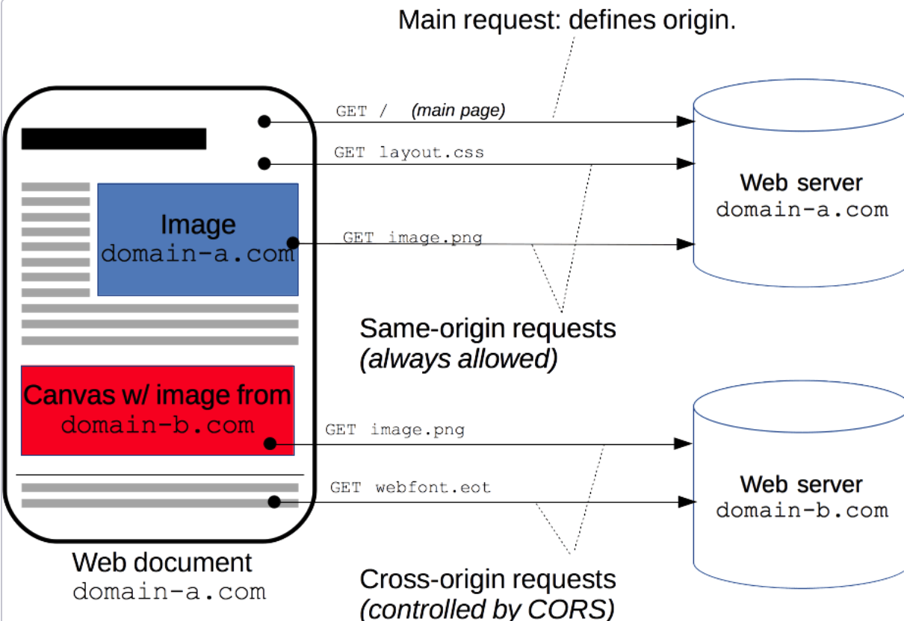
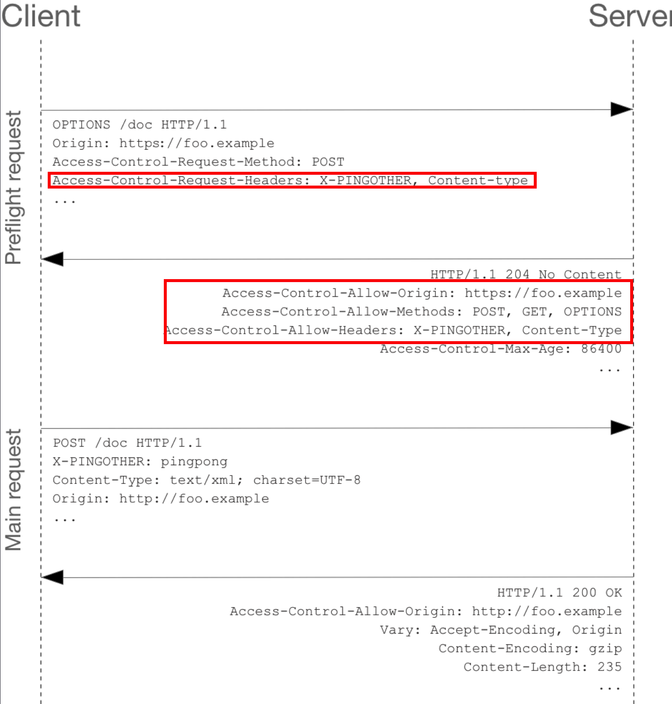

# CORS 跨域资源共享

### 概述

Cross-Origin Sharing，跨域资源共享。

通过设置标识，使客户端可以跨域访问自己。



### 简单请求

#### 满足条件

* 使用 GET / HEAD / POST 任意一种
*   只允许设置的头部包括：Accept / Accept-Language / Content-Language / Content-Type

    > Content-Type 只允许 text/plain, mulipart/form-data, applkication/x-www-form-urlencoded
* XHR 对象没有注册任何事件监听

#### 请求报文

```
GET /resources/public-data/ HTTP/1.1
Host: bar.other
User-Agent: Mozilla/5.0 (Macintosh; Intel Mac OS X 10.14; rv:71.0) Gecko/20100101 Firefox/71.0
Accept: text/html,application/xhtml+xml,application/xml;q=0.9,*/*;q=0.8
Accept-Language: en-us,en;q=0.5
Accept-Encoding: gzip,deflate
Connection: keep-alive
Origin: https://foo.example
```

> 浏览器在发送跨域请求时，默认带上 Origin

#### 返回报文

返回报文中的 `Access-Control-Allow-Origin` 为 `*`，表明该资源可以被任意外域访问

当然也可以指定白名单域名

```
HTTP/1.1 200 OK
Date: Mon, 01 Dec 2008 00:23:53 GMT
Server: Apache/2
Access-Control-Allow-Origin: *
Keep-Alive: timeout=2, max=100
Connection: Keep-Alive
Transfer-Encoding: chunked
Content-Type: application/xml

[XML Data]
```

### 预检请求

除了简单请求外，其他的请求需要进行一次 `Preflight request`，使用 OPTIONS 方法发起一次预检

比如某一次跨域请求携带了自定义 Request Headers，那么就要实现发送一个 OPTIONS 请求



Request Headers 携带了两个属性：

```
Access-Control-Request-Method: POST
Access-Control-Request-Headers: X-PINGOTHER, Content-Type
```

告诉服务器需要使用的方法及会携带的 Headers 内容，服务器收到决定是否允许。

#### Access-Control-Max-Age

在规定时间内，之后不需要 Preflight Request

### XHR / Fetch 附带身份凭证的请求

使用 XHR 或者 Fetch 发送请求时，可以携带身份凭证，如 Cookie。

在跨域的时候，使用 XHR 发送 Cookie 是需要设置 withCredentials = true

```js
// 从 https://foo.example -> https://bar.other
const invocation = new XMLHttpRequest();
const url = 'https://bar.other/resources/credentialed-content/';

function callOtherDomain() {
  if (invocation) {
    invocation.open('GET', url, true);
    invocation.withCredentials = true;
    invocation.onreadystatechange = handler;	// 设置后才能携带 cookie
    invocation.send();
  }
}
```

然后虽然是一个 GET 的简单请求，不会发送 Preflight Request。

但是，服务器需要返回 `Access-Control-Allow-Credentials：true` 的 Response Headers，那么浏览器不会将数据返回给调用者。

#### Access-Control-Allow-Credentials

设置了该属性后，相应的

* Access-Control-Allow-Origin
* Access-Control-Allow-Headers
* Access-Control-Allow-Method

都不能设置为 `*`，而是要指定白名单。


### 相关 Response Header

1. Access-Control-Allow-Origin
2. Access-Control-Allow-Methods
3. Access-Control-Allow-Headers
4.  Access-Control-Expose-Headers

    跨域时，默认 XHR 请求只能拿到一些最基本的 Headers，其他头需要显式的设置暴露
5. Access-Control-Allow-Credentials
6. Access-Control-Max-Age

### 相关 Request Header

1. Origin (跨域默认被发送)
2. Access-Control-Request-Method
3. Access-Control-Request-Headers
