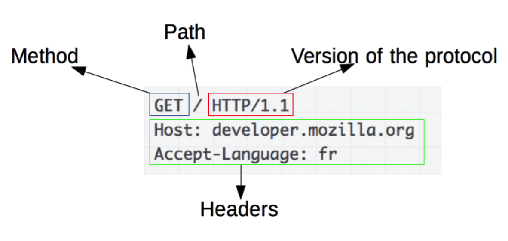
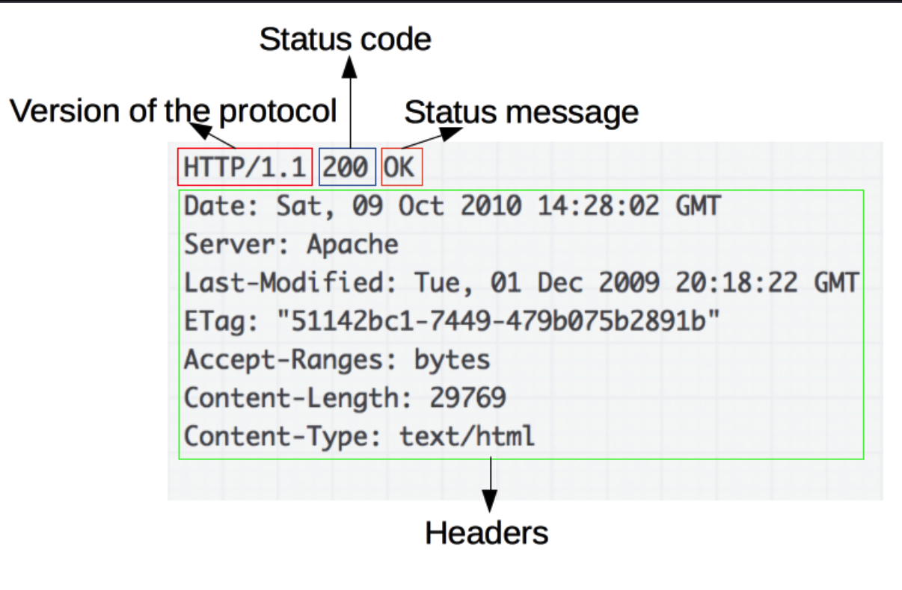
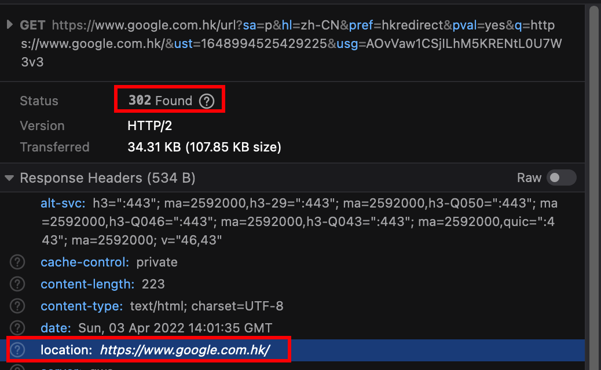
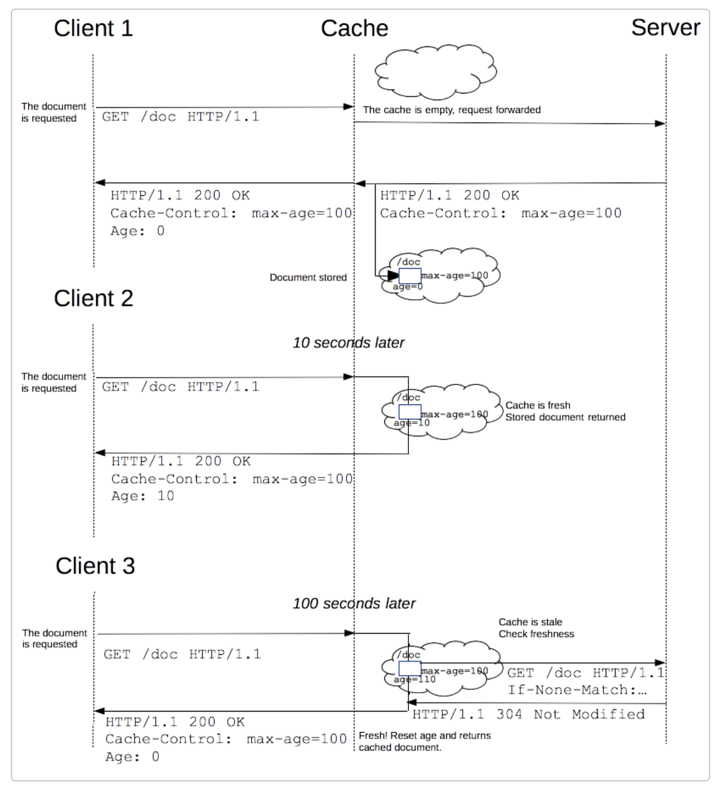
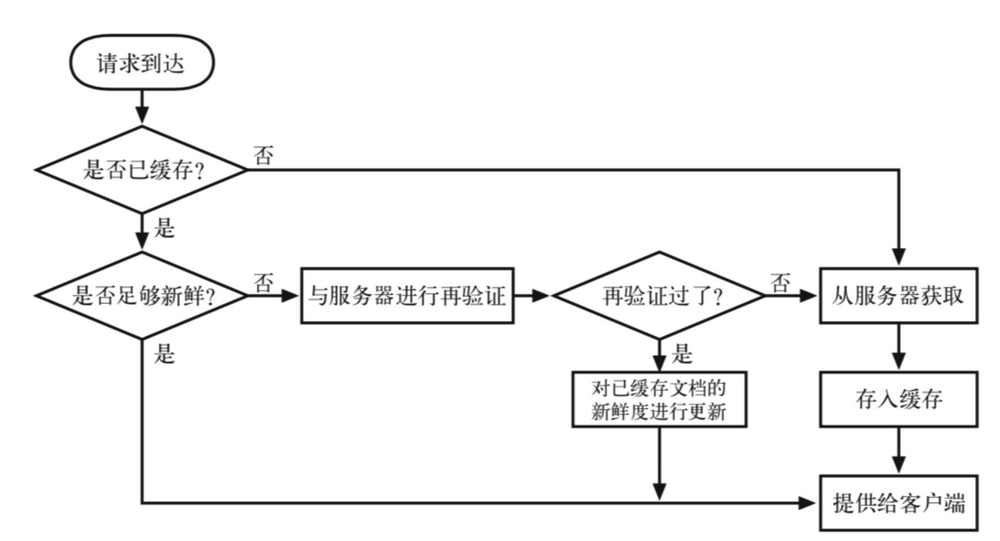
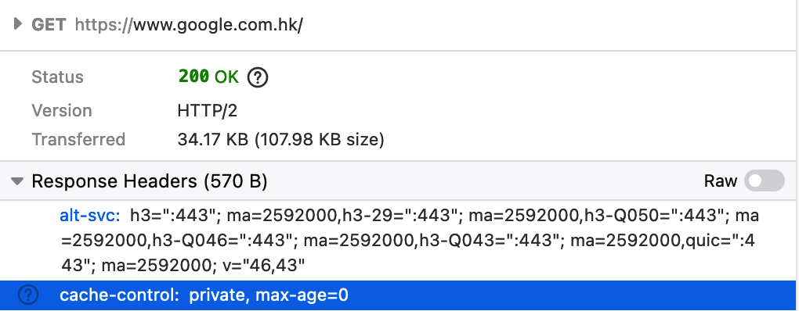

# HTTP

### 概述

HTTP 遵循 C/S 模式，是一种无状态的传输协议。虽然一般工作在 TCP 之上，但是也可以使用其他可靠的传输层协议，如 RUDP。

HTTP 一般由客户端发起。


#### HTTP 可以控制

* 缓存，服务器告诉客户端哪些文件需要缓存，缓存多久
* 开放 SOP 限制
* 认证 (Authenticate / Cookie)
* 会话 (Cookie)

#### HTTP 流

地址解析 -> 建立 TCP 连接 -> 发送 HTTP 报文 -> 读取服务器返回的报文 -> 关闭连接 / 请求重用连接

> HTTP/2 之前的报文是语义可读的，HTTP/2之后，内容被封装在帧中。

### HTTP 报文

> HTTP/2 的报文被嵌入在一个新的二进制结构，帧。
>
> 帧可以首先很多优化，如：报文头部的压缩复用。

HTTP 报文分为两种：请求报文，相应报文。

#### 请求报文



#### 响应报文



> Status message：可以由服务器自行设置

### HTTP 的发送方式

* XMLHttpRequest(XHR), Fetch API
*   EventSource（服务器 -> 客户端发送）

    > EventSource 是服务端推送的一个网络事件接口，一个 EventSource 实例会对 HTTP 服务开启持久化连接
    >
    > 与 WebSockets 不同的是：EventSource 是单向的

### HTTP 请求方式

#### 三种特性

* Safe：操作不会修改服务器数据
* 幂等：相同请求执行一次和多次效果是相同的（所有 Safe 方法都是幂等的，反之不是）
* Cacheable

| 方式      | 描述                       | 特性               |
| ------- | ------------------------ | ---------------- |
| GET     | 请求一个资源，用于获取数据            | Safe，幂等，Cachable |
| HEAD    | 与 GET 相似，但是没有相应体         | Safe，幂等，Cachable |
| POST    | 将实体提交到指定资源               | Cachable         |
| PUT     | 使用请求中的 payload 创建或替换一个资源 | 幂等               |
| DELETE  | 删除指定资源                   | 幂等               |
| CONNECT | 与目标资源标识的服务器建立一个隧道        |                  |
| OPTIONS | 查询目标资源支持的通信选项            | Safe，幂等          |
| TRACE   | 沿着到目标资源的路径执行一个消息回环测试     |                  |
| PATCH   | 对资源应用部分修改                | Cachable         |

#### HEAD

与 GET 相似，唯一不同的是不接受 Response Body，一个引用场景：在下载一个大文件之前先读取 Response Header 中的 Content-Length 来预估文件大小。

#### PUT

PUT 与 POST 的区别是：PUT 是幂等的，而 POST 不是。

PUT 的返回：

* 200 (OK)
* 201 (Created)
* 204 (No Content)

#### DELETE

DELETE 返回：

* 202 (Accepted)，还不确定有没有删除
* 204 (No Content)
* 200 (OK)

#### OPTIONS

查询资源可以接受的 HTTP 方法，返回在 Response Header 中。

```
HTTP/1.1 204 No Content
Allow: OPTIONS, GET, HEAD, POST
Cache-Control: max-age=604800
Date: Thu, 13 Oct 2016 11:45:00 GMT
Server: EOS (lax004/2813)
```

#### POST

POST 一般用于表单提交，通过设置

的 `enctype` 属性或  的 `formenctype` 属性来指定 Content-Type。

* application/x-www-form-urlencoded：K / V 以类似 GET 参数的形式（key1=value1\&key2=value2)，非字母的字符会被转换成 percent encoded
* mutipart/form-data：每个 value 都是以块数据传输的
* text/plain

除了 可以发送 POST 请求，XHR、Fetch 都可以发送 POST 请求。使用后者发送时，body 可以使任何类型。

### HTTP 状态码

1. 信息响应 (100–199)
2. 成功响应 (200–299)
3. 重定向消息 (300–399)
4. 客户端错误响应 (400–499)
5. 服务端错误响应 (500–599)

#### 信息响应 (100–199)

| Code                    | Description                   |
| ----------------------- | ----------------------------- |
| 100 Continue            | 目前一切正常，客户端可以继续请求              |
| 101 Switching Protocols | 相应客户端需要切换协议的请求（请求头中Upgrade参数） |
| 102 Processing          | 服务器接收到并正在处理，但暂时无相应可用          |
| 103 Early Hints         | 允许用户在服务器准备相应阶段时预加载资源          |

#### 成功相应 (200-299)

| Code                              | Description                    |
| --------------------------------- | ------------------------------ |
| **200 OK**                        | 成功的具体含义取决于 HTTP 方法             |
| **201 Created**                   | 成功并创建了资源。通常用于 PUT / POST       |
| 202 Accepted                      | 请求收到，但无结果                      |
| 203 Non-Authoritative Information | 成功响应，但内容经过 proxy 发生了变化，与源服务器不同 |
| **204 No Content**                | 请求成功，但客户端用户不需要修改。              |
| 205 Reset Content                 | 告知用户重置文档，刷新界面                  |
| **206 Partial Content**           | 请求成功，并返回部分数据区间（在请求头 Range 设定）  |
| 207 Multi-Status                  | 同时满足多个状态码对应的情况                 |
|                                   |                                |
| 208 Already Reported              |                                |
| 226 IM Used                       | 响应是对当前实例应用的一个或多个实例操作结果的表示      |

**204 No Content**

请求已成功，但客户端不需要离开当前页面。默认情况下 204 是可缓存的。

一个使用惯例是：**用 PUT 请求更新资源，但不需要将改变展示给用户，就返回 204**；如果创建了资源，就返回 201，如果需要更新，就返回 200。

**206 Partial Content**

1.  单个区间，**返回的结果值包含 47022 内的 21010-47021 共计长度为 26012 的内容**

    ```
    HTTP/1.1 206 Partial Content
    Date: Wed, 15 Nov 2015 06:25:24 GMT
    Last-Modified: Wed, 15 Nov 2015 04:58:08 GMT
    Content-Range: bytes 21010-47021/47022
    Content-Length: 26012
    Content-Type: image/gif

    ... 26012 bytes of partial image data ...
    ```
2.  多个区间，需要指定 Content-Type 为 multipart/byteranges，和多个区间的分割符 boundary=String\_separator

    ```
    HTTP/1.1 206 Partial Content
    Date: Wed, 15 Nov 2015 06:25:24 GMT
    Last-Modified: Wed, 15 Nov 2015 04:58:08 GMT
    Content-Length: 1741
    Content-Type: multipart/byteranges; boundary=String_separator

    --String_separator
    Content-Type: application/pdf
    Content-Range: bytes 234-639/8000

    ...the first range...
    --String_separator
    Content-Type: application/pdf
    Content-Range: bytes 4590-7999/8000

    ...the second range
    --String_separator--
    ```

#### 重定向 （300-399）

重定向的 URI 会携带在 `Response Header` 中的 `Location` 属性中



| Code                      | Description                              |
| ------------------------- | ---------------------------------------- |
| 300 Multiple Choice       | 请求有多个可能的响应，应该由用户自行选择                     |
| **301 Moved Permanently** | 请求资源已永久更改                                |
| **302 Found**             | 请求资源临时更改，未来还可能有新的改变，所以下次还是要访问这个 URI      |
| **303 See Other**         | 必须通过 GET 访问新的 URL                        |
| **304 Not Modified**      | 缓存，响应没有被修改，所以客户端仍然可以使用之前的版本              |
| 307 Temporay Redirected   | 与 302 有相同语义，但是客户端**不能以另一个方法向新 URI 发送请求** |
| 308 Permanent Redirected  | 与 301 有相同语义，同上，不能以另一个方法发送请求              |

**301**

301 浏览器会缓存重定向地址。有时候使用了 301 会引发 bug，因为浏览器会默认缓存。

**302**

资源被暂时移动到了 Location 所指定的新位置上。

> 搜索引擎不会对 302 的连接进行更新

**303 See Other**

通常作为 PUT 或 POST 操作的返回结果，比如在成功操作后重定向至结果页面，而不是新的上传页面。必须通过 GET 获取新的 Location。

**其余重定向方法**

1.  HTML`<meta>`标签

    ```js
    <head>
      <meta http-equiv="Refresh" content="0; URL=http://example.com/" />
    </head>
    ```

    > http-equiv 设置为 Refresh，content = 0, 后面还跟着 URL 标识 0s 后跳转到 URL 所指
2. window.location

#### 客户端错误相应 （400-499）

| Code                              | Description                                                 |
| --------------------------------- | ----------------------------------------------------------- |
| 400 Bad Request                   | 客户端错误（错误请求语法，无效请求）                                          |
| **401 Unauthorized**              | 客户端徐对自己进行身份验证才能获得请求                                         |
| 402 Payment Required              |                                                             |
| **403 Forbidden**                 | 客户端没有访问内容的权限，不同于 401，服务器知道客户端身份                             |
| **404 Not Found**                 | 找不到请求的资源                                                    |
| 405 Method Not Allowd             | 请求的方法不允许                                                    |
| 406 Not Accepted                  | 指代服务器端无法提供与 Accept-Charset 以及 Accept-Language 消息头指定的值相匹配的响应 |
| 407 Proxy Authentication Required | 类似 401 但是认证需要由代理完成                                          |
| 408 Request Timeout               | 给一些空闲的连接发送，关闭这个未使用的连接                                       |
| 409 Conflict                      | 请求与服务器当前状态冲突                                                |
| 410 Gone                          | 请求内容被删除且没有转发地址，客户端需要删除缓存和指向资源的链接。                           |

**404**

404 不能明确资源是临时丢失还是永久，因为如果明确是永久，应该返回 410。

**408**

服务器返回 408 时，应该将 Connection 设置为 close。408 意味着连接即将关闭。

#### 服务端错误响应 (500-599)

| Code                                | Decription                |
| ----------------------------------- | ------------------------- |
| **500 Internal Server Error**       | 服务器遇到了不知道怎么处理的情况（万能）      |
| 501 Not Implemented                 | 请求方法不支持（GET HEAD 是默认必须支持） |
| 502 Bad Gateway                     | 网关或代理服务器从上游服务器收到的响应是无效的   |
| 503 Service Unavailable             | 服务器没有做好处理请求的准备（如维护或停机）    |
| 504 Gateway Timeout                 | 网管或代理服务器无法在规定时间内获得响应      |
| 505 HTTP Version Not Supported      | 服务器不支持请求的 HTTP 版本         |
| 506 Variant Also Negotiates         | 服务器存在内部配置错误               |
| 507 Insufficient Storage            | 服务器无法完成存储从而无法响应请求         |
| 508 Loop Detected                   | 服务器处理请求是检测到循环             |
| 510 Not Extended                    | 服务器需要对请求进行进一步扩展才能完成请求     |
| 511 Network Authentication Required | 客户端需要身份验证才能获得访问权限         |

#### 503 Service Unavailable

服务器上位做好处理请求的准备。通常原因是服务器维护货已经超载。返回 503 时，应该也返回一个友好页面来解释原因。还可以设置 Retry-After 来指明预计恢复时间。

> 503 一般应用于临时情况，一般不应该设置缓存。

#### 511 Network Authentication Required

511 不是由服务器返回的，而是由拦截代理服务器返回的。如一些公共 WiFi 的身份验证。

### HTTP Headers

自定义的 Headers 可以通过 `x-` 前缀来添加，不过目前已被弃用。

消息头分为 4 类别：

* General headers: 适用于 request & response
* Reqeust headers
* Response headers

#### Request Headers

| Headers         | Description                                                               |
| --------------- | ------------------------------------------------------------------------- |
| Accept          | 浏览器可以接受的 MIME 类型，默认发送 \*/\*                                               |
| Accept-Encoding | 接受的压缩编码方法（gzip, deflate）                                                  |
| Accept-Language |                                                                           |
| Connection      | Keep Alive / Close                                                        |
| Host            | 必须设置，不然返回 400                                                             |
| Refer           | 请求页面的来源                                                                   |
| Origin          | 与 Refer 相似，所有跨域请求 / 除 GET，HEAD 以外的请求浏览器都会自动携带                             |
| User-Agent      | 客户端信息（浏览器，操作系统）                                                           |
| Cache-Control   | no-store, no-cache/ private, public/ max-age, max-stale / must-revalidate |
| Cookie          |                                                                           |
| Range           | 请求部分，可以用来做断点续传，返回的是 206，如：bytes=0-1023 返回前1024个字节                         |

#### Response Headers

| Headers           | Description                              |
| ----------------- | ---------------------------------------- |
| Cache-Control     |                                          |
| Content-Type      | 返回内容的 MIME，如 text/html;charset=UTF-8     |
| Content-Encoding  | 压缩方法                                     |
| Date              | 发送 Response 的时间                          |
| Server            | 服务器信息                                    |
| Expires           | 缓存到期时间，因为时间可能不同步，所以 max-age 更好           |
| Connection        | keep-alive / close                       |
| Last-Modified     |                                          |
| ETag              |                                          |
| Refresh           | 用于重定向                                    |
| Content-Range     |                                          |
| Transfer-Encoding | Transfer-Encoding: chunked：告诉客户端资源是分块发送的 |
| Vary              | 对我未来的一个请求头，应该用缓存回复还是重新发起请求               |

#### MIME

格式：`type/subtype;parameter=value`

* type 比如有 text, video
* subytpe 指明具体的类型，如 text/html, text/plain
* 后面还可以跟上参数，比如 text/plain;charset=UTF-8

type 类型：application, audio, example, font, image, model, text, video

常见的 MIME Type

| MIME                       | Description                                                     |
| -------------------------- | --------------------------------------------------------------- |
| text/plain                 | plain 不是用来作为万能匹配的，比如：若不指明 type/css，浏览器不会将 css 识别出来，即便他就是 css 代码 |
| text/css                   |                                                                 |
| text/html                  |                                                                 |
| text/javascript            |                                                                 |
| image/gif(png,jpg,webp...) |                                                                 |
| audio/webm...              |                                                                 |
| video/ogg..                |                                                                 |

`mulipart/form-data`：一个文档可能包含多种 MIME 类型，可以在后面的参数上指明一个分隔符（在实际报文中在分隔符前面再加入--），如：

```
Content-Type: multipart/form-data; boundary=aBoundaryString
(other headers associated with the multipart document as a whole)

--aBoundaryString
Content-Disposition: form-data; name="myFile"; filename="img.jpg"
Content-Type: image/jpeg

(data)
--aBoundaryString
Content-Disposition: form-data; name="myField"

(data)
--aBoundaryString
(more subparts)
--aBoundaryString--
```

`mulipart/byteranges`：发送部分数据，返回 206。每一个部分都有一个 Content-Type, Content-Range

```
HTTP/1.1 206 Partial Content
Accept-Ranges: bytes
Content-Type: multipart/byteranges; boundary=3d6b6a416f9b5
Content-Length: 385

--3d6b6a416f9b5
Content-Type: text/html
Content-Range: bytes 100-200/1270

eta http-equiv="Content-type" content="text/html; charset=utf-8" />
    <meta name="viewport" content
--3d6b6a416f9b5
Content-Type: text/html
Content-Range: bytes 300-400/1270

-color: #f0f0f2;
        margin: 0;
        padding: 0;
        font-family: "Open Sans", "Helvetica
--3d6b6a416f9b5--
```

#### Accept-Encodding

压缩方法：gzip, compress, deflate, br

#### Quality Values

`;q=`：用来在 Http headers 中设置优先级，如 `Accept-Language: en-US,en;q=0.5`

### HTTP 缓存

#### 私有缓存

浏览器本地缓存的，只供一个用户单独使用。

#### 共享缓存

能被多个用户使用，如 ISP 会架设 web 来将一些热门资源进行缓存、CDN。

#### 缓存案例

> 通常情况下，GET 的 Response 才会被缓存

* 一个成功的 GET （200） 请求的响应
* 301 永久重定向
* 404 的一个页面
* 206 不完全的响应，只返回局部的部分

#### 缓存控制

`Cache-control` 头包含在请求与响应中

**可缓存性**

* no-store：不缓存，每次都重新下载（没有强缓存和协商缓存）
*   no-cache：将请求（携带一些与本地缓存有关的验证字段）提交给服务器进行验证，服务器检查后决定是否要使用缓存。（只有协商缓存）

    > `Pargma` 头，请求头重包含 Paragma 的效果与 Cache-control: no-cache 相同。(HTTP/1.0定义的)
    >
    > Pargma 只包含在请求头中，不包含在响应头，因此只能作为向后兼容使用。
* public：可以被任何中间人缓存
* private：只能缓存在个人浏览器中

**到期**

* max-age=：缓存过期时间
* max-stale：即便过期了秒，也使用这个

**验证方式**

* must-revalidate：在考虑使用一个陈旧资源时，必须先验证他的状态，才能使用。
* immutable：用户刷新浏览器也不会发送请求，适合应用在一些静态资源上，告诉浏览器这个资源不会改变。

#### 新鲜度

缓存会过期，因此需要检验他的新鲜度。当浏览器在请求之前发现某一个缓存过期了，会在请求头中携带 If-None-Match，服务器收到后会比对，如果没有仍然 Fresh 则返回 304，否则返回新的实体。客户端如果接收到 304 会重新刷新 age



#### 缓存验证

如果设置了 Cache-control: must-revalidate，或者浏览器设置了强制缓存验证都会触发缓存验证

#### 强缓存 vs 协商缓存

1. 浏览器请求时，判断 response header 是否命中缓存，如果命中就直接读取，不会发送请求。
2. 如果没有命中缓存，会发送请求给服务器，判断协商缓存是否命中，返回 304 或者新资源。



#### 强缓存

客户端请求资源后，服务端返回的响应里就做了缓存配置，如过期时间。



还可以设置 `Expires` 头，在 Expires 之前，浏览器都会直接命中缓存

> 强缓存就是给资源设置一个过期时间，每次请求都会查看是否过期。

#### 协商缓存

强缓存是由客户端自行管理的，而协商缓存是有客户端与服务端交互协商的。

**Last-Modified**

`Last-Modified: <day-name>, <day> <month> <year> <hour>:<minute>:<second> GMT`

服务器在 Response Header 中携带，标识服务器认定资源最后修改的时间。

客户端接收到之后，下次的请求会把它携带在 If-Modified-Since / If-Unmodified-Since 头里，服务器接收到后会进行校验。

服务器比较 If-Modified-Since 和本地的 Last-Modified 的值，如果相同，说明缓存有效。

* 如果资源被修改，返回 200，并附上你资源
* 如果没有修改，返回304，不带上资源

> Last-Modified 有时候是不够的，比如：
>
> * 有些资源是周期性重写的，其实内容没变
> * 被修改的内容不重要，如注释
> * Last-Modified 精度不高（只能精确到秒）

**If-(Un)Modified-Since**

* If-Modified-Since：修改过才返回
* If-Unmodified-Since：才会返回

**ETag**

ETag 携带在 Response Header 中，是资源特定版本的标识符。

如果 URL 资源发生变更，一定要生成新的 Etag 值。

语法：

```
ETag: W/"<etag_value>"
ETag: "<etag_value>"
```

*   W/(Optional)：使用弱验证器

    > 弱验证：弱验证不同于强验证，十分严格的比较两个文档是否相同。弱验证可以忽略掉一些不重要的变化，比如页面中的页脚、广告内容不相同，但使用弱验证的话，他们仍然被当做相同的资源。
    >
    > 弱验证不易实现，因为很难精准的判断出哪些资源重要，哪些不重要。

数据签名：对资源内容进行一个唯一标记。典型方法通过 Hash 计算。

ETag 对应着 If-Match / If-None-Match，这两个会携带在请求头中发送给服务器，交由服务器验证缓存。

ETag 的两个作用：

* 避免空中碰撞
* 缓存检验

**If-Match**

服务器仅在请求的资源满足此首部列出的 `ETag`值时才会返回资源。

**If-None-Match**

当且仅当服务器上没有任何资源的 [`ETag`](https://developer.mozilla.org/zh-CN/docs/Web/HTTP/Headers/ETag) 属性值与这个首部中列出的相匹配的时候，服务器端才会返回所请求的资源。

**Last-Modified vs ETag**

Last-Modifed 是弱比较，时间不能很精确

ETag 是强比较，但是加上 W/ 也可以变成弱比较

> Expire Cache-Control 用回车、后退、F5 刷新会跳过本地缓存，而是直接向服务器请求

If-Match 的优先级大于 If-Modified-Since

#### 缓存级别

从上到下逐层寻找，直到命中。

1. Service Worker
2. Memory Cache
3. Disk Cache
4. 网络请求

**Cache-Control**

| Request          | Response                 |
| ---------------- | ------------------------ |
| `max-age`        | `max-age`                |
| `max-stale`      | -                        |
| `min-fresh`      | -                        |
| -                | `s-maxage`               |
| `no-cache`       | `no-cache`               |
| `no-store`       | `no-store`               |
| `no-transform`   | `no-transform`           |
| `only-if-cached` | -                        |
| -                | `must-revalidate`        |
| -                | `proxy-revalidate`       |
| -                | `must-understand`        |
| -                | `private`                |
| -                | `public`                 |
| -                | `immutable`              |
| -                | `stale-while-revalidate` |
| `stale-if-error` | `stale-if-error`         |

### 版本发展

#### HTTP/0.9

只有 GET 请求，没有请求头和返回头

#### HTTP/1.0

* 增加方法
* 返回 CODE，请求头响应头
* 增加多字符集支持，多部分发送，权限，缓存
* Connect：Keep-Alive

#### HTTP/1.1

* 默认连接可以复用
* 管线化技术，在一个 TCP 连接上可以栓送多个 HTTP 请求和相应
* 增加 host 请求头，可以让服务端识别到请求来源的 host。这样多个服务可以部署在同一个服务器上（使用不同的 host 区分）
* 更多缓存策略，ETag
* 请求头加入 Range，可以传输部分数据，206返回

#### HTTP/2.0

* 传输的是二进制，而不是文本。
* 数据分装成帧传输，可以并发传输。
* 服务端推送。
* 压缩 Headers，双方各缓存一份 header fields，消除一些不必要的重复传输。
