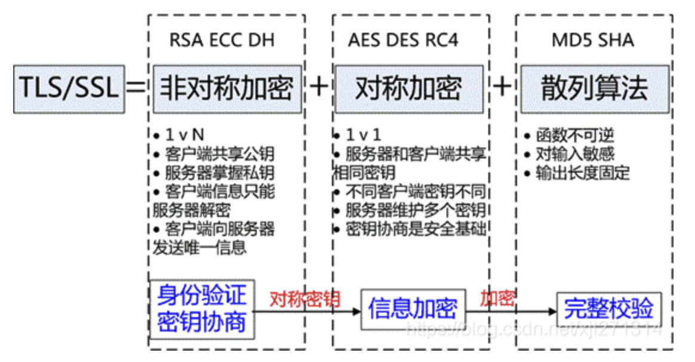
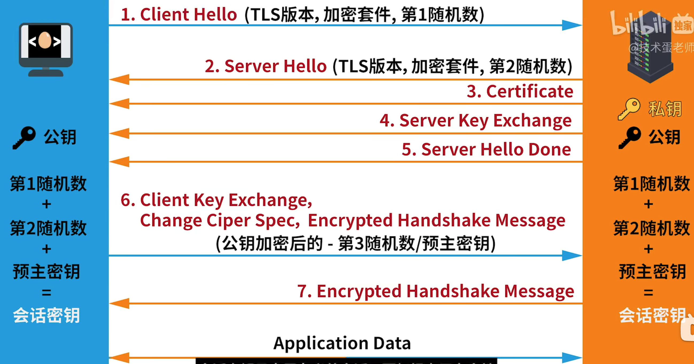
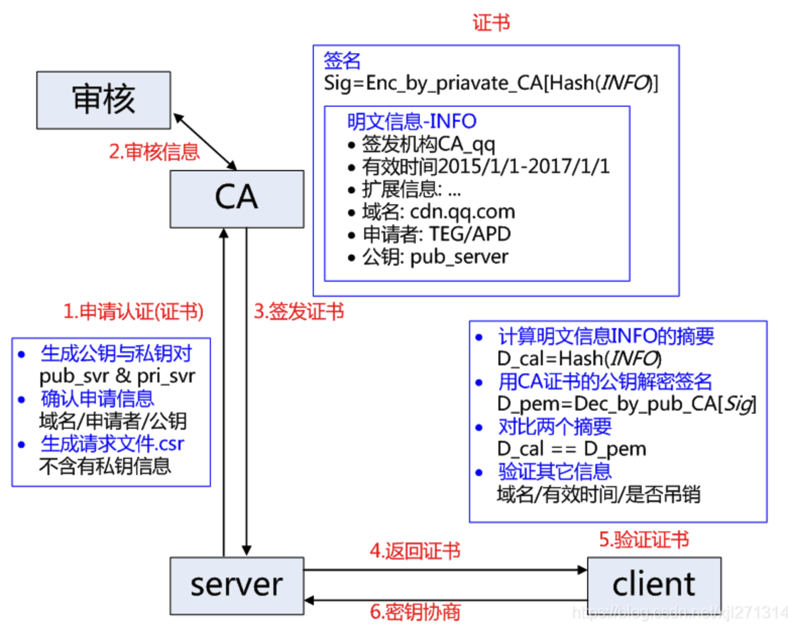

# HTTPS

### 概述

HTTPS 是 HTTP 的加密版本，使用 TLS / SSL 来加密。

> TLS / SSL 区别？SSl 是 TLS 的前身

TLS / SSL 使用的是非对称加密。TLS / SSL 工作在 TCP 和 HTTP 之间的一层协议。

### 非对称加密

公钥是可以公开的，而私钥只有服务端持有。公钥加密的只能私钥解密，反之亦然。非对称加密的特点是 1 对 N。

常见的算法有 `RCA`，还包括 `ECC`, `DH`

非对称加密的计算代价较高

### 对称加密

双方共享一个密钥，保密性依赖于密钥的保护。

常见的的算法有 `AES`, `DES`,`RC4`

### TLS 工作过程

1. 客户端发起 HTTPS 请求，发送第一个随机数
2. 服务端返回第二个随机数，证书和公钥
3. 客户端生成预主密钥。并使用公钥发送至服务端，然后服务端用私钥解密
4. 双方根据第一、第二随机数，和预主秘钥生会话秘钥。
5. 最后双方通过会话秘钥进行对称加密通信。

### 身份验证和证书

防止公钥被伪装，客户端向错误的服务器发送内容，客户端发送的数据就会被伪装者截获。

证书由第三方组织 CA 签发。客户端可以验证证书的公钥是否正确。正确后进行秘钥协商。

具体过程：

1. CA 对服务器公钥通过 Hash 生成摘要，再用 CA 的私钥对摘要加密，并附在证书内部。
2. 客户端拿到服务器的证书后，用 CA 的公钥解密证书内部的摘要，再与证书的公钥的 hash 值对比。
