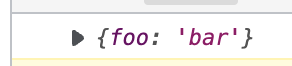
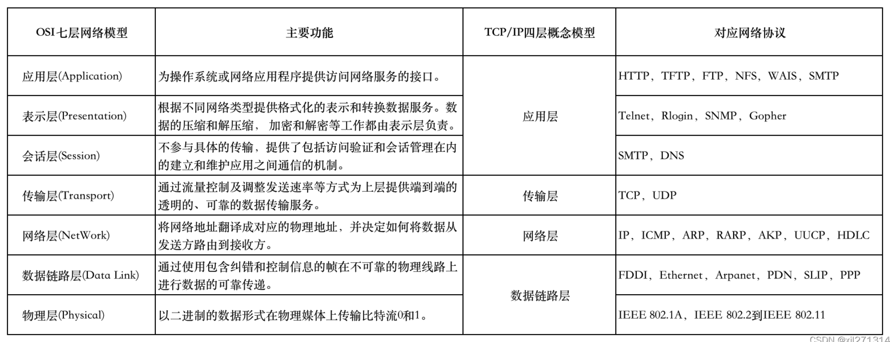
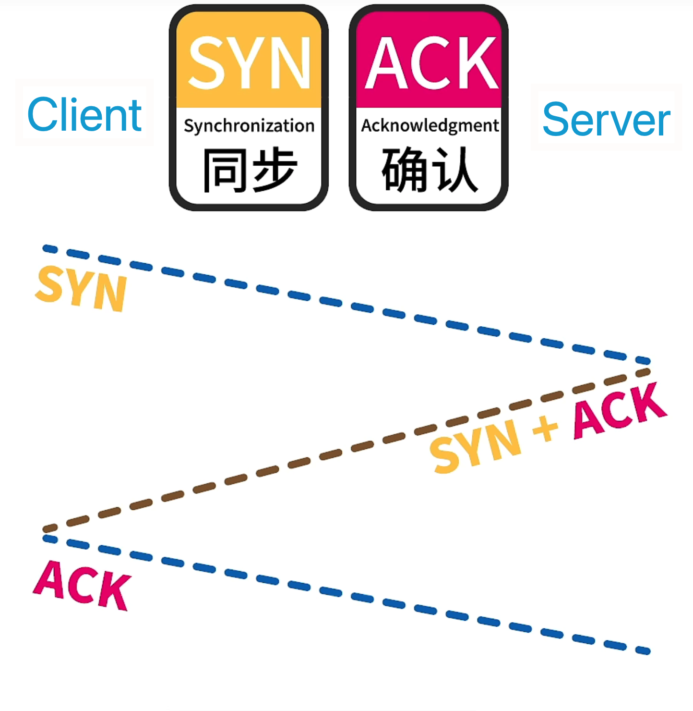
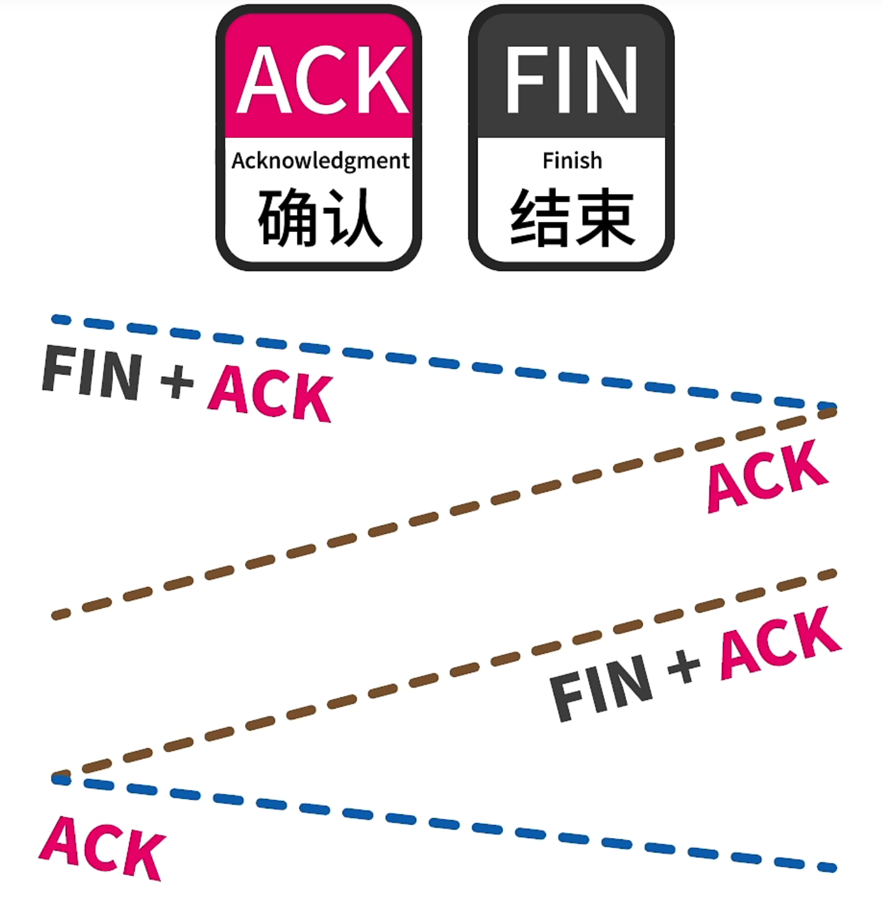

# 网络相关知识

### 跨域

同源策略：协议，域名，端口一致。

三个标签允许跨域：img, link, script

**跨域是可以发送，只是返回的结果被拦截**

#### JSONP

利用 标签可以跨域的特性

**express 后端**

```js
// localhost:3000/jsonp
router.get('/jsonp', function (req, res, next) {
  res.send(`
    console.log(${JSON.stringify({ foo: 'bar' })})
  `)
})
```

**客户端**

```html
<body>
    <script src="http://localhost:3000/jsonp">
        function get(data) {
            console.log(data)
        }
    </script>
</body>     
```

获取到的数据：



#### CORS

后端的 Header 中设置 Acces-Control-Allow-Origin，开启 CORS

#### 反向代理 （node 中间件，nginx）

#### WebSocket

HTML5 一种在 TCP 连接上进行全双工的通信协议

Client 和 Server 只需要完成一次握手，就可以额创建持久性连接，并双向传输数据

创建 WebSocket

```js
const socket = new WebSocket(url, [protocol])
```

通过 send() 发送请求，通过 onmessage 事件来接受信息

### 前后端实时通信

* WebSocket
* event-source
* ajax 轮训

#### GET POST 区别

* get 获取，post 提交
* get 长度有限制，post 无限制
* get 请求参数会显式地显示在 url 中，而 post 在请求体中

### TCP/IP 4层协议

* 数据链路层：传输 mac 帧
* 网络层：发送 IP 数据包，路由转发
* 传输层：提供进程之间的通信，TCP/UDP
* 应用层：各种协议，HTTP，FTP，SSH

### OSI 7 层协议



#### 物理层

负责在不同设备之间传输比特流。屏蔽不同物理设备、传输媒介和通信手段的不同。

#### 数据链路层

将数据封装成帧，通过使用包含纠错和控制信息的帧在不可靠的物理线路上提供可靠传输。

帧的组成：head（数据发送者，接受者，数据类型） + data

传播方式：广播，接受者根据自己的 mac 地址匹配接受

#### 网络层

将网络地址映射成物理地址，为传输层提供端到端的传送服务

常见协议：IP，ARP（IP->MAC)，ICMP

#### 传输层

通过浏览控制和调整发送速率等方式为上层提供端到端的透明的、可靠的传输服务

常见协议：TCP，UDP

#### 会话层

不参与具体的传输，提供了包括访问验证和会话管理在内的建立和维护应用之间通信的机制。

#### 表示层

根据不同网络类型提供格式化的表示和转换数据服务。数据的压缩和解压缩， 加密和解密等工作都由表示层负责。

#### 应用层

为应用程序提供访问网络服务的的

HTTP、FTP、SSH

### TCP & UDP

TCP：面\*\*连接的\*\*、可靠；TCP 添加了序号机制，确认机制，超时重传机制等，不会出现丢包或乱序。TCP 只能点到点

UDP：面向\*\*无连接\*\*的传输协议，提供简单但不可靠的传输服务。UDP 支持 1:N N:1 N:N

#### TCP 三次握手



三次握手防止已经失效的连接传到了服务器，发生错误。如：

第一次发出去的 SYN 因为延迟，导致重发了一遍 SYN，后发的 SYN 先到达了服务器，如果在这之后第一个 SYN 又成功到达服务器的话，服务器可能误以为\*\*发送了两个不同连接\*\*。通过三次握手，即便服务器发送了两个 SYN + ACK，客户端只会 ACK 一个连接。

#### TCP 四次挥手



#### TCP 保证有效传输

有效传输：校验和、序列号、确认应答、超时重传

#### TCP 拥塞控制

TCP 会根据网络情况调整首发速度，通畅时发得快，反之发得慢。四种手段：

1. 慢启动
2. 拥塞避免
3. 快速重传
4. 快速恢复

#### TCP 断点重传

每次下载请求都会带上下载的起始点

### URL

URL = 协议 + 域名 + 端口 + 路径 + 查询参数

#### URI 统一资源标识符

URL 允许用户对网络中某一特定资源以某种协议进行交互

URL 是 URI 的子集

### DNS 查询过程

1. 提出请求
2. 查找本地缓存
3. 若没有命中缓存，直接向根域名服务器发送请求，根域名返回根的子域的 DNS 服务器
4. 递归上一步操作知道查到正确记录
5. 保存缓存

### CDN

将网站的内容发布到接近用户的网络边缘，提高用户访问效率。不同于镜像，CDN会更加智能的分发和引流。

#### 加速原理

1. DNS 请求会发送给 CDN 指定 DNS 服务器
2.  DNS 将全局负载均衡后的 IP 返回给用户，然后用户访问

    依据：用户请求的内容，就近选择，服务器相较空闲
3. 如果访问到的服务器上没有缓存的内容，他会想上一级继续发送请求
