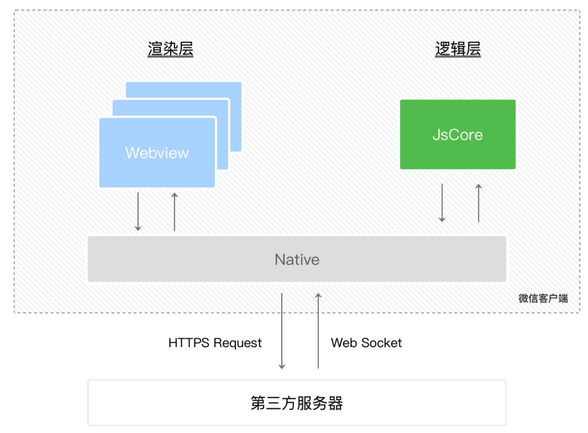

# 小程序与原生 Web 的区别

## 宿主 API

宿主 APP 暴露了如：拍摄、录音、二维码、支付、地图等 API 给小程序。

此外，宿主 APP 还提供了离线存储功能。通过缓存来提高 APP 打开速度，优化白屏问题。

## 渲染 & 脚本线程

* 原生 Web 渲染 & 脚本线程是互斥的（长时间的脚本运行可能会导致页面失去响应）
* 小程序渲染 & 脚本分别运行在两个线程中

> 小程序的逻辑层运行在 `JSCore`中。它既不包含 DOM 和 BOM API，同时也不同于 Node.js。因此，诸如 jQuery 或其他的一些 npm 库是不能运行在小程序中的。

| **运行环境**    | **逻辑层**        | **渲染层**       |
| ----------- | -------------- | ------------- |
| iOS / macOS | JavaScriptCore | WKWebView     |
| Android     | V8             | Chromium 定制内核 |
| Windows     | Chromium       | Chromium      |

小程序主要运行在 iOS / macOS、Android 和 Windows 上。多个平台的 API 不完全相同，小程序基础库提供了 Polyfill 来弥补差异；并且应该开启样式补全来解决样式兼容问题。

## 渲染层 & 逻辑层

* WXML 模板 和 WXSS 样式工作在渲染层，而 JS 脚本工作在逻辑层。
* 多个页面对应多个渲染层，多个渲染之间通过宿主 APP 通信。
* JS 脚本的网络请求也通过宿主 APP 进行中转。

