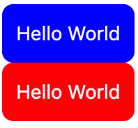

# Context

### Intro

context 可以在多个层级的组件中避免通过 props 单级的层层传递数据。

#### 什么时候需要使用 context ？

当一个组件树需要共享一组全局数据时，如主题、首选语言或当前认证的用户。

但是要避免不要过度滥用 context，他会破坏组件的可复用性。

context 更适合\*\*为每一层组件都提供数据\*\*，而不是针对跨组件（子孙组件需要访问父级组件）进行数据传输。

### createContext(defaultValue)

首先需要创建一个 context，`createContext()` 接受一个”默认值”参数，来保证在找不到 Provider 的时候，可以使用该默认值。

```jsx
// context.js
import React from "react"

const ThemeColorContext = React.createContext('blue')

export {ThemeColorContext}
```

#### defaultValue

defaultValue 是最后的 fallback 选项，是静态的、永远不会修改的。

#### Context 对象

createContext() 返回的是一个 context 对象。Context 对象本身不持有任何信息，它通过 Context.Provider，Context.Consumer 属性来实现新的提供和消费，或者使用 useConext() hook 来消费。

### Class 组件消费 context 提供的值

如果是类组件，使用 `Class.contextType` 来指定某一组件来消费 context 提供的值

```jsx
import React from "react";
import { ThemeContext } from "../../module/context";

class Tag extends React.Component {
    render() { 
        return (
            <div style={{backgroundColor: this.context, color: '#fff', padding: '10px', borderRadius: '8px'}}>{this.props.children}</div>
        )
    }
}
// 在类的外部指定 contextType，在类的内部可以通过 this.context 来消费
Tag.contextType = ThemeColorContext 
export default Tag;
```

或者使用 `static` 关键字在类的内部指定：

```jsx
class Tag extends React.Component {
    // 使用 static 来指定类的静态成员
    static contextType = ThemeColorContext
    render() { 
        return (
            <div style={{backgroundColor: this.context, color: '#fff', padding: '10px', borderRadius: '8px'}}>{this.props.children}</div>
        )
    }
}
```

### Context.Provider

由 createContext 创建的 Context 对象，包含一个 Context.Provider 组件。

被这个组件包裹的其他对象，都可以消费由 provider 指定的 context 值。使用 `value` 属性来指定 context 值。

例如上面的例子，如果不提供一个 Provider，Tag 组件会使用默认的颜色，即蓝色。

而如果用一个 Provider 包裹住，Tag 会消费由 Provider 提供的值。

```jsx
import Tag from './components/tag'
import './App.css'
import { ThemeColorContext } from './module/context'

export default function App() {
    return (
        <div className="container">
            <Tag>Hello World</Tag>

            <ThemeColorContext.Provider value={'red'}>
                <Tag>Hello World</Tag>
            </ThemeColorContext.Provider>
        </div>
    )
}
```



#### 触发重渲染

每当 Provider 的 value 属性发生变更的时候，组件就会触发渲染。

监听 value 变化使用的是浅比较，而不比较具体的内容。因此，有一种情况会触发不必要的重渲染：即 Provider 组件发生渲染后，提供的 value 对象也发生了变化（创建了新的对象），从而触发了重渲染：

```jsx
class App extends React.Component {
  render() {
    return (
      <MyContext.Provider value={{something: 'something'}}>
        <Toolbar />
      </MyContext.Provider>
    );
  }
}
```

可以使用 state 来保存 value 值，从而保证不会触发不必要的重渲染。

#### 多个 Provider 嵌套

Provider 可能不止一个，多个 Provider 可以一层层叠加

```jsx
<ThemeContext.Provider value={theme}>
    <UserContext.Provider value={signedInUser}>
        ...
    </UserContext.Provider>
</ThemeContext.Provider>
```

### Context.Consumer

Context.Consumer 利用 render prop。向它的 children 传入一个渲染函数，这个渲染函数接受一个 context 值，函数内部根据 context 的具体内容来返回一个 React 元素。

context 是自底向上根据最近的 Provider 决定的，如果找不到，则使用 context 的默认值。

```jsx
<MyContext.Consumer>
  {context => /* 基于 context 值进行渲染*/}
</MyContext.Consumer>
```

> 新的 useContext() 实现了类似的功能，更应该考虑使用它。

### useContext()

#### 使用方法

```jsx
const value = useContext(SomeContext)
```

```jsx
import { useContext } from "react";
import { ThemeColorContext } from "../../module/context";

function Tag({children = ''}) {
    const themeColor = useContext(ThemeColorContext)

    return ( 
        <div style={{backgroundColor: themeColor, color: '#fff', padding: '10px', borderRadius: '8px'}}>{children}</div>
     )
}

export default Tag;
```
