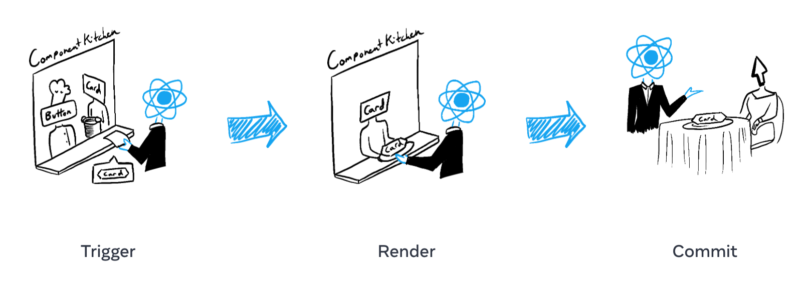

# render\_commit

### Concepts

React 渲染可分为三个阶段：

* Triger render
* Render component
* Commit to DOM

### Trigger Render

以下两种情况可以触发一次渲染：

* 首次渲染
* state 发生改变

### Render Component

当触发渲染(Trigger render)后，React 会调用一次组件来决定如何渲染。

对于函数式组件，就是直接调用一次 function。

组件渲染是递归的，当一个组件内嵌套了另一个组件，那么就会递归地往下继续渲染。

### Commit to DOM

Render 阶段并不会对真实对的 DOM 产生任何改变，DOM 操作发生在 Render 后的 Commit 阶段。

* 对于首次渲染，React 调用 `appendChild()` API 将组件挂载到 DOM 上
* 之后的重渲染，React 利用 diff 算法来 DOM 做最小的更新

**React 只把那些两次 render 结果不同的更新 commit 到 DOM 上。**
