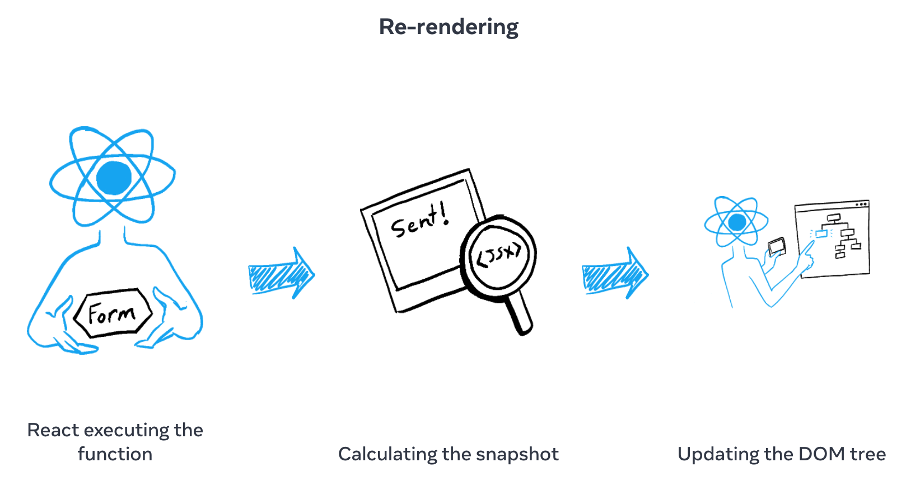
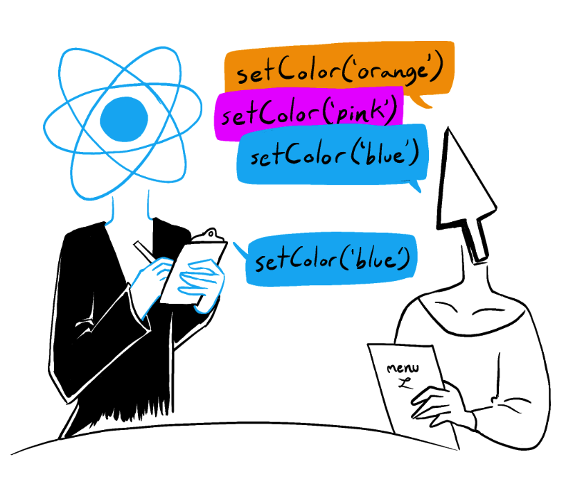

# State

### 把 states 看做一次快照

可以把 states 看做一次快照。一次 render 就是根据 states 计算出了一个结果（快照）。

当 React 在 render 一个组件时，他通过调用组件函数，可以返回一串 JSX 内容。

这个 JSX 内容就相当于一个快照。里面保留了当下的 props，事件回调，本地变量等。这些都是根据 states 计算而来的。

#### 当 re-render 时：

1. 调用组件函数
2. 返回新的 JSX 快照
3. Commit to Dom



#### 一次 snapshot 绑定了 state 和回调函数

一次 render 返回的 JSX 不是完全静态的！它还可以包括各种回调函数，从而实现各种交互功能。

比如你可以通过 `onClick` 属性来触发一次回调，在回调中调用了 `console.log()`来查看当前快照中的某一个 state。

**参考下面这个例子更好的来理解这一概念：**

```jsx
function Foo() {
    const [count, setCount] = useState(0)

    function handleClick() {
        setCount(count + 1)	// 会触发下一次 render，生成新的 snapshot
        console.log(count)  // 输出的仍然是当前 snapshot 内的 state 内容
    }

    return (
        <>
            <h3>Current count: {count}</h3>    
            <button onClick={handleClick}>Add Count</button>
        </>
    )
}
```


> 🔹 一次 JSX 就是一个快照，他保存了当前的 state 和回调函数。
>
> 因此当你调用这个快照里的回调函数去 `console.log()` 一个 state，那这个 state 已经是**被封存的了的**。
>
> 即便你使用了 `setState()`，那他也只不过会触发一个新的 render，而这一次的快照里面的回调函数，自然拿不到新的 snapshot。

#### state 是有记忆性的

和在函数中的普通变量不同，state **并不会在函数执行完毕后就被释放掉**。

state 并不保存在函数内部，而是在函数的外部，被统一管理。

#### state 只会在下一次 render 时改变

这也就解释了为什么调用三次 `setCount(count + 1)` 实际上的 count 并不会 +3，而是只会 +1。

因为当你触发一次 setCount()，当前的 count 并不会变化，他永远都是 0 。

### 队列一系列 state更新

更改 state 会队列一次 render 操作。但是有时候，你想在一次 render 中，操作多次更新操作。

事实上，React 会在执行完所有回调函数后才会执行 re-render 操作。

比如，如果有多个 setState() 操作，React 会将它们放入到一个队列中。直到所有 setState() 都被推入队列后，才会执行 re-render。在执行 re-render 时，在从队列中读入这些操作，然后计算出最后的 state 值。



换句话说，在没有执行完所有回调操作后，UI 并不会发生更新。

不过，一些主动回调，比如 `onClick` 回调，React 不会也等他执行了，才会更新 UI。这也很合理，就算你没有点击按钮触发 `onClick` 回调，也不能影响 UI 的正常更新。

#### setState() 队列

所有的 setState() 操作，不管你传入的是一个 `value` 还是 `function` ，**都会被推入到一个队列中**。

直到所有 setState() 操作全部入队，React 会触发下一次 re-render。然后，根据入队的顺序，依次执行。

对于 value 和 updater function，处理的方法是不同的：

* 如果队列中读到 `setState(value)`，**那么直接覆盖 state**，不需要管之前的是什么。**因为这个 value 是确认的**。
* 如果队列中读到 `setState(n => n + 1)`，**那么会根据上一个 state 计算出新的 state**。

按照上面的法则，即可以计算出最终的 state 值：比如：

```jsx
// init: 0
setNumber(n => n + 1)	// 1
setState(10)			// 10
setNumber(n => n + 1)	// 11
setState(20)			// 20
```

最终的 state 值就是 20，React 会把 20 更新到 UI 上去。
