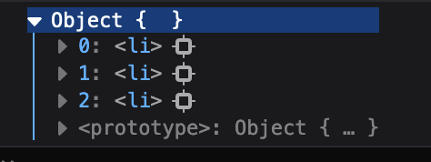

# useRef

### Intro

`useRef` 可以引用一个与渲染无关的值。一般可以用在以下场景：

* 引用一个值
* 通过 ref 操作 DOM
* 暴露组件的一个 ref

> 🔹 useRef() 和 useState() 的区别就在于：
>
> 修改 ref 不会触发 re-render，这意味着，useRef() 很适合存储那些与 UI 无关的数据

通过 `useRef`，你可以：

*   和 state 一样，在两次 render 之间存储信息。而不像普通变量，每次 re-render 都会重置变量。

    > **🙋 useRef() 和普通的变量有什么区别？**
    >
    > 普通的变量在组件下一次渲染时，就会被重置。有些内容，需要被持久化的保存下来的，比如计时器的引用。
    >
    > 如果你使用普通变量来保存计时器的引用，在下次渲染时，引用会指向一个新的计时器。
* 修改数据不会触发 re-render。
* 每个组件都是独立存储的。

### Usage

```js
const ref = useRef(initialValue)
```

#### 参数

只接受一个参数，即设置初始值。只有在首次渲染时进行初始化操作，re-render 时会被忽略。

#### 返回

`useRef` 返回一个 `ref` 对象 ，`ref` 对象 只包含一个 `current` 属性。`current` 属性故意设计成了 mutable 的。

在下一次的渲染时，useRef() 还是会返回这个 `ref` 对象。当然，你可以访问 `current` 属性来读取或者修改。

> 🔹 因为 `ref` 是个对象，所以每次返回的其实都是同一个对象的引用！
>
> （我猜测这也是用 current 封装一层的原因，这样不管是值类型还是对象，都会变成一个对象的引用。）

#### 特点

* ref.current 是 mutable 的，而不像 state 那样。你可以直接读取或者修改 ref.current。
*   修改 ref.current 不会触发重渲染，因为你只修改了 `ref` 内部对象的属性，而对 `ref` 对象的\*\*本身的引用并没有改变。\*\*自然，React 也不会检测到 `ref` 发生了变化。

    > 事实上，只要你修改的对象与渲染无关，React 并不关心你到底有没有修改它。

#### 不要在 render 时操作 ref

为了保证组件表现为纯函数，不要在 render 时读写 ref。

### 通过 ref 引用一个值

修改 useRef 引用的值并不会触发 re-render，可以看下面的例子

```jsx
function App() {
  const count = useRef(0)
  
  function handleClick() {
    count.current = count.current + 1
    console.log(count.current)
  }
    
  return (
    <>
      <h3>Current Count: {count.current}</h3>
      <button onClick={handleClick}>Add Count</button>
    </>
  )
}
```


> ⚠️ 实际上，不应该在 render 中对 ref 进行任何读写操作，上面的案例只是为了演示。

### 通过 ref 操作 DOM

在 JSX 中给原生标签添加 ref 属性，从而可以控制访问它们。

```jsx
function Input() {
    const inputRef = useRef(null)

    function handleClick() {
        inputRef.current.focus()
    }

    return ( 
        <>
            <input ref={inputRef} />
            <button onClick={handleClick}>Focus Input</button>
        </>
     )
}
```

> ⚠️ 不要给自定义的 Component 加上 ref 标签！如需，使用 `forwardRef`

#### 使用 ref callback 来管理一组 DOMs

当你想动态地创建一组 refs 来绑定多个 DOM 元素，可以使用 callback 来实现。

元素的 ref 属性可以传入一个函数，该函数的第一个参数即指向该元素：

```jsx
<li ref={ node => ... } />
```

然后可以用一个对象 / Map 来保存每个元素之间的对应关系，或者使用数组也行：

```jsx
const itemsRef = useRef({})
```

然后在 callback 中绑定：

```jsx
ref={ node => itemsRef.current[item] = node }
```

这样，就可以动态地给每一个元素绑定上一个 ref，接着通过 id 之类的属性来访问对应的 DOM 元素



#### forwardRef()

forwardRef 可以负责将父组件的 ref 转发给子组件。

forwardRef 会创建一个 React 组件，并且把接收到的 ref 传递给它。

```jsx
const MyInput = forwardRef((props, ref) => {
    return <input ref={ref} />
})
```

然后在使用这个组件的时候，就可以给这个组件设置 ref 属性了

```jsx
function App() {
    const inputRef = useRef(null)

    function handleClick() {
        inputRef.current.focus()
    }

    return (
        <div className="container">
            <MyInput ref={inputRef}/>
            <button onClick={handleClick}>Show Input</button>
        </div >
    )
}
```

#### useImperativeHandle()

使用 forward 的一个问题是父组件对于暴露的 ref 有着 100% 的控制权。

可以通过 useImperativeHandle() 来限制父组件的访问权，仅暴露他能控制的属性。

```jsx
const MyInput = forwardRef(function MyInput(props, ref) {
    // realInputRef 只在内部组件使用，外部组件只能通过包装后的 ref 来有限制地访问
    const realInputRef = useRef(null)
    
    useImperativeHandle(ref, () => {
        return {
            focus() {
                // 对真实 ref 上的 focus 方法进行了包装
                realInputRef.current.focus()
            }
        }
    })

    return <input ref={realInputRef} />
})
```

useImperativeHandle() 将 forwardRef 传入的 ref 拦截。这样父组件在使用 ref 访问的时候，实际上是访问了用它包装后的 ref，上面只暴露了需要的操作。（有点类似 OOP 的封装）

#### React DevTools 显示名称

如果默认传入一个箭头函数，则在 DevTools 中看不到 forwardRef 创建出来的组件的名称，而是显示为 “FowardRef”

你可以传入一个有命名的函数：

```jsx
forwardRef(function Foo(props, ref) {
    ...
})
```

#### React 什么时候会将 refs 绑定到 DOM 上？

每次更新可以分成两个阶段：

* render：调用组件来决定需要渲染哪些内容
* commit：将改变应用到 DOM 上

React 并不会在 render 阶段绑定 refs，这也符合“避免在 render时操作 ref“这一原则。原因如下：

1. 在首次渲染时，render 阶段真实的 DOM 并不存在，因此无法绑定
2. 在重渲染时，render 阶段的 DOM 也还没有更新，因此绑定要被淘汰的 DOM 也没有意义。

#### flushSync

默认情况下，setState() 并不会立即触发更新。而是在将他推入到一个队列中，等到所有回调全部入队后再一并更新。

flushSync 可以强制同步更新 DOM。（这种概念有点类似 async / await )

被 flushSync 包裹的代码会立即触发 DOM 更新，然后在继续执行后续代码。

```jsx
// setState() 会触发 DOM 的立即更新
flushSync(() => {
    setState(...)
})
    
// 下面的代码将会拿到更新后的 DOM
console.log(domRef.current)
```

### useRef() vs useState()

|          | ref                   | state                  |
| -------- | --------------------- | ---------------------- |
| 返回值      | 带有 current 属性的 ref 对象 | 当前 state 和 setState 方法 |
| 变更是否触发渲染 | 否                     | 是                      |
| Mutable  | 可以修改                  | 不可以修改                  |
| 读写限制     | 不应该在 render 时进行读写     | 可以在任何时候读               |

#### useRef() 内部如何实现的？

原理上 useRef() 可以用 useState() 来实现的：

```jsx
function useRef(initialValue) {
    const [ref, unused] = useState({ current: initialValue })
    // 只返回保存的 ref 对象，不需要返回 setState 方法
    return ref
}
```

### 避免 useRef() 重复调用初始化函数

useRef(initialValue) 虽然只会在第一次时读取初始值.

但是如果你通过一个函数来获得初始值时，虽然 useRef() 会忽略在后续的渲染中忽略你传入的 initialValue ，但是这个初始化函数每次仍然会被调用。

```jsx
// getInitValue() 在每次渲染时都会被调用
useRef(getInitValue())
```

一种解决方法就是初始化将 ref 为 null，并且在首次调用时为其赋值

```jsx
const fooRef = useRef(null)

if (fooRef.current === null) {
    fooRef.current = getInitValue()
}
```

> 🔹 通常情况下，在 render 中操作 ref 是不允许的。但是上述做法并不会破坏 purity。
>
> 因为他模拟了 useRef() 的机制，只有在首次渲染时，才会调用一次 getInitValue() 来获取值，后续再也不会为 null。

另一种方法就是包装一个 get 函数来获取 ref：

```jsx
function App() {
    const fooRef = useRef(null)
    
    function getFooRef() {
        if (fooRef.current === null) {
            fooRef.current = getInitValue()
        }
        return fooRef.current
    }
}
```
