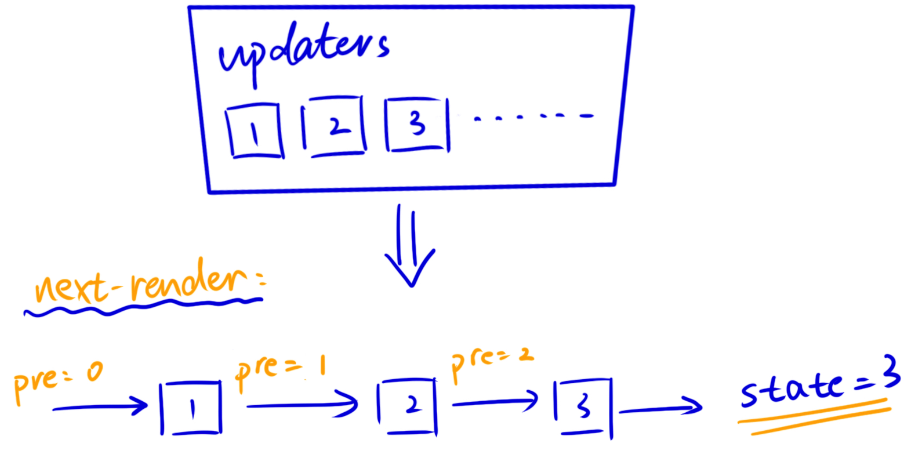

# useState

### 使用

```jsx
const [state, setState] = useState(initialState)
```

### initalState

useState() 接受一个初始值，React 会在第一次渲染组件时保存它，而在之后的重渲中会直接忽略。

#### 使用一个函数来获得初始值

可以使用一个函数来获取初始值，如 `getInitValue()`。

```jsx
function getInitValue() {
    return 0
}

function Counter() {
    // ❌ 错误做法，会导致每次 re-render 时重新调用 getInitValue()
    const [count, setCount] = useState(getInitValue())
    ...
}
```

上面的做法看上去十分直觉，但是会引发问题：虽然在 re-render 时，initalState 会被忽略，但是 `getInitValue()` 这个函数**会被再次调用**。（尽管上面的例子中的 `getInitValue()` 并不会带来多大开销）

正确做法是：不在 useState() 中直接调用用这个函数，而是直接把 `初始化函数` 传递给 useState()。

```jsx
// ✅ 正确做法，直接传入初始化函数
const [count, setCount] = useState(getInitValue)
```

> useState() 可以接受一个函数作为参数，如果你传入了一个初始化函数，React 只会在首次渲染中调用它。

在严格模式下，React 会将这些函数调用两遍，来检测他们是否是纯函数。如果是的话，调用两次也不会也不应该产生问题。

### 根据当前 state 更新 newState

一个简单的方法：

```jsx
setCount(count + 1)
```

但是，如果调用上面的方法多次，会得到以外的结果：

```jsx
function handleClick() {
    // ❌ 调用三次 setState 并不会把 count 加三次。相反，只会得到 +1 的结果。
    setCount(count + 1)
    setCount(count + 1)
    setCount(count + 1)
}
```

#### 通过 updater 函数来更新

`setState()` 可以接受一个 updater 函数：

* updater 函数必须是 pure 的。
* 只能接受一个参数，即当前的 state。
* 需要返回新的 state。

```jsx
// 习惯上会把当前 state 这个参数取原 state 变量的首字母，如 count -> c，fooBar -> fb
setCount(c => c + 1)
```

> **🙋 是不是所有根据当前 state 更新 newState 的操作都需要 updater ？**
>
> 其实不是必要的，但是如果你为了保证一致性或者正确性，也可以使用它。
>
> 或者，当你在同一事件内要多次更新某一 state，考虑使用它。

将上面的函数调用三次，可以得到想要的效果。

```jsx
function handleClick() {
    setCount(c => c + 1)
    setCount(c => c + 1)
    setCount(c => c + 1)
}
```

上面的三次 setCount 会被推入到一个队列中，会在下次 re-render 时，依次调用。

三个 updater 推入到队列中**不代表组件要被重新渲染三次**！而是，在下次渲染的时候，链式的调用，从而得到最后的正确值。



下面的代码调用了三次 updater：

```jsx
function Counter() {
    const [count, setCount] = useState(0)

    useEffect(() => console.log('Component rendered.'))

    function addCount() {
        setCount(c => {
            console.log(`Previous count is: ${c}`)
            return c + 1
        })
    }

    function handleClick() {
        addCount()
        addCount()
        addCount()
    }

    return (
        <>
            <h3>Current Count: {count}</h3>
            <button onClick={handleClick}>Add</button>
        </>
    );
}
```


### setState() 的坑

`setState()` 方法只会更新你下一次 re-render 时候的 state。而在 `setState()` 之后继续读取 state，**仍然是当前的 state**。

这也就是为什么，调用三次 `setState()` 并不能达到你想要的效果。因为尽管调用了三次，但是每次读到的 state 并不是更新后的！

```jsx
function Counter() {
    const [count, setCount] = useState(0)

    function handleClick() {
        setCount(count + 1)
        // 第一次调用 setCount() 之后继续读取 count，仍然是 0（初始值）
        console.log(count)  // 0
        
        setTimeout(() => {
            console.log(count); // Also 0!
        }, 5000);
    }
    ...
}
```

* setState() 后会使用 Object.is 来进行比较，如果比较结果相同，则会跳过不执行 re-render。
* [React 会将一系列 states 更新打包](../advanced\_concepts/batch\_state\_updates.md)，他会等到所有事件回调完成后，并且所有 setState() 方法都运行后，才会执行 re-render。

#### setState() 参数

`setState()` 接受一个值或者一个 updater 函数。

如果接受一个值，这个值是可以任意的 type。但是仔细体会这个 `nextState`，这个值在传入进去的时候，**就已经确定好了**！这也就是为什么调用三遍 `setCount(count + 1)` 并没有效果，因为你每次实际上调用的都是 `setCount(1)`。

#### setState() 返回

无返回值

### 更新对象或数组

#### 更新对象

利用扩展运算符来更新新的对象

```jsx
// 新属性 foo 会覆盖旧的属性
setState({
    ...state,
    foo: 'bar'
})
```

> ⚠️ `...` 运算符是浅拷贝，需要保证所有属性都是值类型

当你的对象层级大于一层时，需要谨慎处理。假设需要更新 `person.artwork.city` 属性：

```jsx
setPerson({
  ...person,			// Copy other fields
  artwork: {			// but replace the artwork
    ...person.artwork,	// with the same one
    city: 'New Delhi'	// but in New Delhi!
  }
});
```

**使用 Immer 来更新对象**

使用 useImmer() 来替代 useState()，他们在使用起来没太大区别；唯一在更新对象时，可以使用如下的语法：

```jsx
const [state, updateState] = useImmer(initialState)

updateState(draft => {
  // 注意传入的这个函数
  // 要么直接 return 一个新的值
  // 要么就不要 return，而是直接在里面修改。就像下面这样，但需要加上 { }
  draft.foo = 'bar';
});
```

修改对象时，就好像它是 mutable 的。

> https://github.com/immerjs/use-immer

#### 更新数组

和更新对象类似，你也应该把数组当做 immutable 的。因此，诸如 `arr[0] = 0`，`push()`，`pop()` 操作都是不允许的。

相反，一些可以返回新数组的 API 是可以使用的，如：`map()`，`filter()`。

参考下面的表格，可以将左边的操作转换为右边的：

|           | ❌                        | ✅                    |
| --------- | ------------------------ | -------------------- |
| adding    | `push`, `unshift`        | `concat`, `[...arr]` |
| removing  | `pop`, `shift`, `splice` | `filter`, `slice`    |
| replacing | `splice`, `arr[i] = ...` | `map`                |
| sorting   | `reverse`, `sort`        | 先复制一个副本在进行原地操作       |

> ⚠️ 数组的 `...` 操作也存在浅拷贝问题，使用之前确保所有元素都是值类型

此外，还可以通过 Immer 来完成更新数组，Immer 不仅可以直接执行 `arr[0] = 0` 这样的操作，还可以使用 `push()`，`pop()` 等直接在数组原位置修改的 API。

### 其他应用

#### 通过 key 来重置 state

你可以用一个 state 来管理某一元素的 key，然后当你修改这个 state 的时候，key 也发生了变化，会触发渲染新的组件。

```jsx
const [version, setVersion] = useState(0)

// version 改变后，也会渲染新的 Form 元素
function handleClick() {
    setVersion(version + 1)
}

return (
    <Form key={version} />
)
```

#### 保存上一次更新的信息

你可以需要在组件发生渲染时，更新 state 信息。但在多数情况下，你都不需要这么做。

比如，你需要在 count prop 发生改变时，来判断相较于上一个 count，新的 count 是增加了，还是减少。

这时，就可以利用 state 来保存上一次信息。

> 可以把 state 理解成一个 Ref，他保存在组件之外，因此即便组件重渲了，这个数据还存在。

#### 使用 useState() 来保存一个函数

如果你直接把函数传入 useState()，或者 setState() 中，React 会把它们分别当做初始化函数和 updater 。

所以正确做法是，使用闭包来返回一个高阶函数：

```jsx
const [fn, setFn] = useState(() => someFunction);

function handleClick() {
  setFn(() => someOtherFunction);
}
```

### Immutable

**state 是 immutable 的**，注意他是用 const 来解构 useState() 的返回值的。

所以对于值类型来说，你肯定是不能直接改变的，因为 const 不允许你修改他。

而对于引用类型，虽然在语法上你是可以修改的，但是你也应该把它当成 immutable 的。

无论如何，都应该使用 setState() 来更新，而不是直接操作它们！

#### 为什么 state 要设计成 immutable 的？

* 方便 Debug：每一次 render 的 state 都是不变的，你可以通过如 `console.log()` 来快速的 Debug。
* 方便优化：React 根据 state 是否发生变化来决定是否执行 re-render。对于 object 类型的 state，利用 immutable 的话就可以确保：如果 object 的引用没有发生变化，那么 object 的内容也一定不会变化。这样 React 只需要比较引用值，而不需要递归地比较对象内容。
