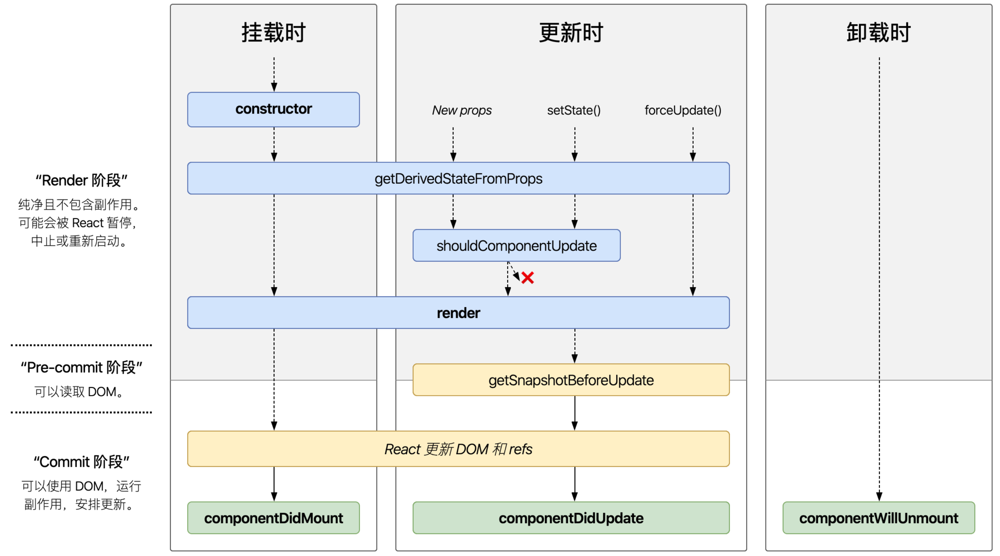

# React 相关问题

### 虚拟 DOM

用 js 对象结构来表示 DOM 树，当文旦更新时，先更新虚拟 DOM，然后比较和之前的虚拟 DOM树的区别，再把差异的地方应用到 real DOM 上.

和 real DOM 区别：

| **Real DOM**       | **Virtual DOM**     |
| ------------------ | ------------------- |
| 1. 更新缓慢。           | 1. 更新更快。            |
| 2. 可以直接更新 HTML。    | 2. 无法直接更新 HTML。     |
| 3. 如果元素更新，则创建新DOM。 | 3. 如果元素更新，则更新 JSX 。 |
| 4. DOM操作代价很高。      | 4. DOM 操作非常简单。      |
| 5. 消耗的内存较多。        | 5. 很少的内存消耗。         |

概括：更新快，代价小。

虚拟 DOM 可以将多次操作合并成一个；借助 DOM diff 可以把多余操作省略掉。（减少次数，范围）

### 组件通信方式

1. 父组件用 props 传给子组件
2. 子组件通过回调函数将信息传给父组件
3. 发布/订阅的方式
4. Redux 全局状态管理

### Redux

所有的数据都存储在一个树形结构中，唯一改变他的方法就是将一个 action dispatch 给 store，store 会调用 reducer 来改变数据。

#### action

就是个 js 对象，包含 type 和可选的 payload

```js
 const someAction = {  
   type: 'domain/eventName',  
   payload: 'xxx'   // optional
 }
```

#### reducer

本质上就是一个函数，传入现有的 state 和 action，然后根据 action 和 state 内容来修改，最后返回更新的 state

#### store

是一个 js 对象，保存着所有状态

#### 原则：

1. 单一来源，所有数据存储在一个树形结构
2. 状态只读，修改必须使用 action
3.  使用纯函数进行更改

    > 纯函数：函数的执行结果只依赖于传入参数，不会有其他副作用

### key

在 diff 算法中判断元素是被移动过来的还是新创建的，减少不必要的重复渲染

### diff 算法

* Tree diff: 树形结构按照层级分解，同级元素相互比较。如果是节点是组件，就看 Component diff，如果是标签，就看 Element diff。
  * 给列表结构中的每个单元添加唯一 key 属性，方便比较
* Component diff：先比较类型，不同就直接发生替换。如果类型相同，那就检查属性是否相同，然后继续 Tree diff。
* Element diff：先比较标签名，标签名不同直接替换，如果标签名相同，检查属性，然后继续 Tree diff。
* 可以使用 shouldCOmponentUpdate 拦截

### 生命周期



### hooks

通过一系列 useXXX API 使得函数式组件也能实现许多类组件的功能

### 为什么浏览器无法读取 JSX

浏览器只能处理 js 对象，需要通过babel转译

### refs

能获取对某一 react 组件的引用

### react 事件绑定

// todo
