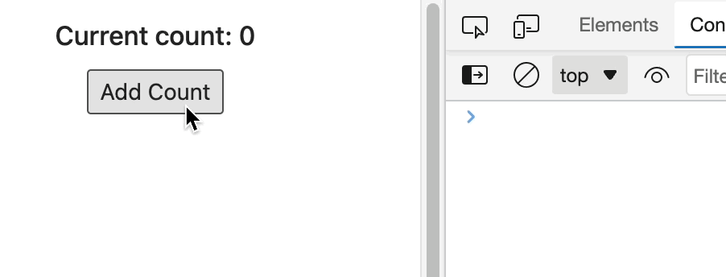
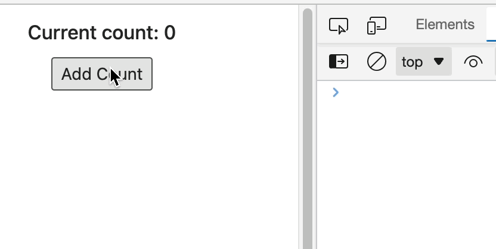

# Class vs Function

## 语法上

- 类组件可以有 state，生命周期；但是函数式组件没有，而是通过 hooks 来实现
- 类组件需要继承 React.Component，在创建时需要实例化
- 函数组件是一个纯函数（hooks不算），输出只有 props 决定
- 函数组件可以通过自定义 Hooks 来抽象复用代码；而类组件可以使用 HOC 或者 render prop

## 函数组件可以捕获每一次渲染的快照

函数组件利用闭包的特性，每一次的 return 都是一个 JSX 快照，包含了当前的 state，props 和各种回调函数。

参考下面的例子，当点击按钮后，500ms 之后不会输出新的 count：

```jsx
function Foo() {
    const [count, setCount] = useState(0)

    function handleClick() {
        setCount(count + 1)
        // 输出的是 500ms 前的旧值
        setTimeout(() => console.log(count), 500)
    }

    return (
        <>
            <h3>Current count: {count}</h3>    
            <button onClick={handleClick}>Add Count</button>
        </>
    )
}
```



而如果使用类组件，则会得到不一样的结果：

```jsx
class Foo extends React.Component {
    constructor(props) {
        super(props)
        this.state = {
            count: 0
        }
    }

    handleClick = () => {
        this.setState({count: this.state.count + 1})
        // 输出的是 500ms 之后的新值
        setTimeout(() => console.log(this.state.count), 500)
    }

    render() {
        return (
            <>
                <h3>Current count: {this.state.count}</h3>
                <button onClick={this.handleClick}>Add Count</button>
            </>
        )
    }
}
```



造成这样的原因是因为类组件的 this 是动态变化的。

而对于函数是组件，它可以捕获一层渲染的所有状态。利用到了闭包的特性。

### useRef()

如果想使用函数式组件来实现类组件上述的效果，则可以利用到 useRef() 。

因为 ref 是 mutable 的，而不像 state 或者 props 都是 immutable 的。

```jsx
function Foo() {
    const [count, setCount] = useState(0)

    const countRef = useRef(null)

    function handleClick() {
        setCount(count + 1)
        countRef.current = count + 1
        setTimeout(() => console.log(countRef.current), 500)
    }

    return (
        <>
            <h3>Current count: {count}</h3>    
            <button onClick={handleClick}>Add Count</button>
        </>
    )
}
```


> https://overreacted.io/zh-hans/how-are-function-components-different-from-classes/
