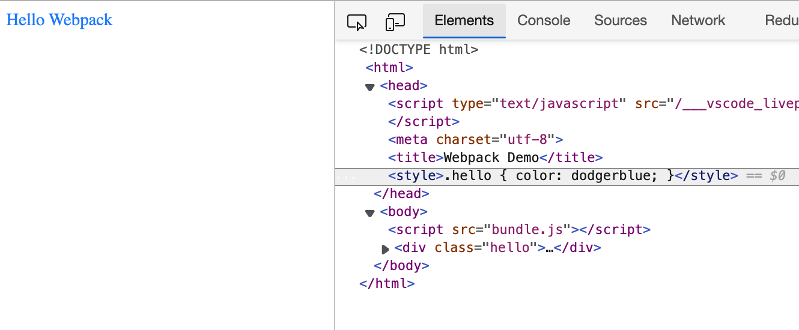

# 资源管理

**通过 loader 或内置的 Asset Modules 引入任何非 JavaScript 文件**

### CSS

**Requirements**

*   `style-loader`

    将 CSS 插入到 DOM 中
*   `css-loader`

    可以将 css import 进 js 中

```bash
yarn add -D style-loader css-loader
```

**webpack.config.js**

```js
module: {
  rules: [
    {
      test: /\.css$/,
      use: ['style-loader','css-loader']
    }
  ]
}
```

被 import 的 css 文件会以 `<style>` 标签的形式插入到 `<head>` 中



> `<style>` 标签是由 js 动态地创建并插入的，因此在打包后的 html 文件中是看不到的，只有在运行时可以看见

### images

**Requirements**

* `Asset Modules`：Webpack 5 内置的模块

**webpack.config.js**

```js
module: {
  rules: [
    {
      test: /\.(png|svg|jpg|jpeg|gif)$/i,
      type: 'asset/resource',
    }
  ]
}
```

**xxx.js**

```js
import img from './xxx.jpg'
```

**xxx.css**

```css
url('./ann-QWJ39062Dpc-unsplash.jpg');	// 使用 url() 的形式来引入
```

### fonts

**webpack.config.js**

```js
module: {
  rules: [
    {
      test: /\.(woff|woff2|eot|ttf|otf)$/i,
      type: 'asset/resource',
    }
  ]
}
```

**xxx.css**

```css
/* 使用 url() 形式引入字体 */
@font-face {
	font-family: 'FiraCode';
	src: url('./FiraCode-Regular.ttf');
}
```
