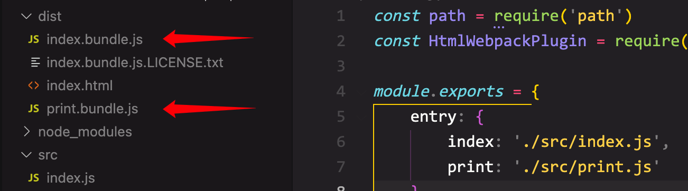

# 管理输出

**动态地生成 index.html ，并且动态地向其中添加打包好的 bundle**

### 独立的 bundle

**webpack.config.js**

```js
module.exports = {
    entry: {
        js1: './src/js1.js',
        js2: './src/js2.js'
    },
    output: {
        filename: '[name].bundle.js',
        path: path.resolve(__dirname, 'dist'),
        clean: true		// 打包时自动清理上一次文件
    },...
}
```

这样每一个 js 文件都会被打包成独立的 bundle，并且按照对应的文件名命名



### HtmlWebpackPlugin

```bash
yarn add -D html-webpack-plugin
```

自动生成 html 文件

**webpack.config.js**

```js
plugins: [
  new HtmlWebpackPlugin({
    title: 'xxx'
  })
]
```
